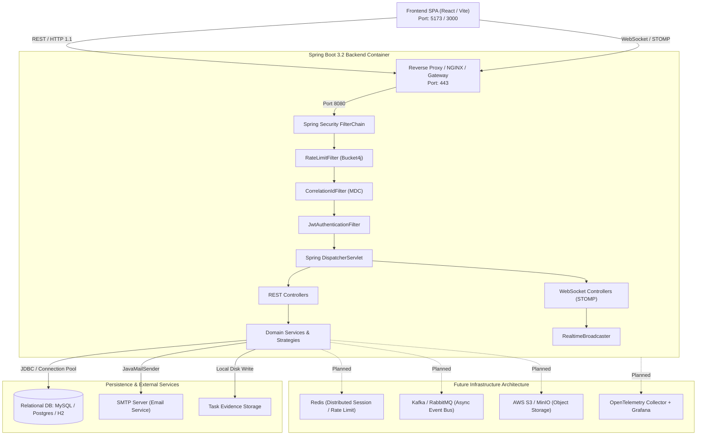

# System Architecture Overview

Back to **[Master Index](README.md)** | View **[Architecture Decision Records](adr/README.md)**

---

## 1. Deployment Topology



---

## 2. Package Layer Dependencies & Boundaries

```
src/main/java/com/example/taskflow/
├── config/              # Global Configuration & Security Chain
├── controller/          # REST Controllers
├── domain/              # JPA Entities & Enums
├── dto/                 # Request & Response DTO Data Contracts
├── exception/           # Custom Domain Runtime Exceptions
├── repository/          # Spring Data JPA Repositories
├── security/            # SpEL Evaluators & Permission Handlers
├── service/             # Domain Services & Business Logic
└── strategy/task/       # Task Scope Lifecycle Strategies
```

### Layer Isolation Rules
1. **Repositories** must never inject Services or Controllers.
2. **Domain Entities** must remain pure JPA POJOs without `@Autowired` dependencies.
3. **Strategies** must never reference Controller classes directly.
