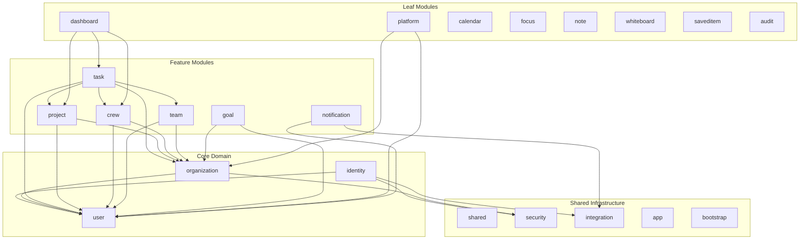

# System Architecture Overview

Back to **[Master Index](README.md)** | View **[Architecture Decision Records](adr/README.md)**

---

## 1. Deployment Topology

```mermaid
graph TD
    Client["Frontend SPA (React / Vite)<br/>Port: 5173 / Netlify"] -->|REST / HTTP 1.1| AppServer
    Client -->|WebSocket / STOMP (native)| AppServer
    
    subgraph AppServer["Spring Boot 3.2 Backend Container (Port 8080)"]
        direction TB
        CorrelationFilter["1. CorrelationIdFilter<br/>(MDC: X-Correlation-Id, Order: HIGHEST_PRECEDENCE)"]
        CorsFilter["2. CorsFilter<br/>(Origins: localhost:5173, Netlify, DevTunnels)"]
        RateLimiter["3. RateLimitFilter<br/>(Bucket4j + Caffeine, /api/v1/auth/* only)"]
        JwtAuth["4. JwtAuthenticationFilter<br/>(Bearer JWT → SecurityContext + token version check)"]
        UserAuthFilter["5. UsernamePasswordAuthenticationFilter<br/>(Bypassed for JWT; active for /api/v1/auth/login)"]
        ExceptionFilter["6. ExceptionTranslationFilter<br/>(Catches AccessDenied/AuthenticationException)"]
        SecurityInterceptor["7. MethodSecurity<br/>(SpEL: CustomPermissionEvaluator → DomainPermissionHandlers)"]
        
        CorrelationFilter --> CorsFilter
        CorsFilter --> RateLimiter
        RateLimiter --> JwtAuth
        JwtAuth --> UserAuthFilter
        UserAuthFilter --> ExceptionFilter
        ExceptionFilter --> SecurityInterceptor
        SecurityInterceptor --> Dispatcher["DispatcherServlet"]
        
        Dispatcher --> RESTControllers["REST Controllers (34 classes)"]
        Dispatcher --> WSController["WebSocket Controllers (STOMP)"]
        
        RESTControllers --> Services["Domain Services & Strategies"]
        WSController --> Broadcaster["RealtimeBroadcaster"]
    end
    
    subgraph AsyncPools["Async Thread Pools (AsyncConfig)"]
        EmailExec["emailExecutor<br/>core=2, max=5, queue=1000"]
        RealtimeExec["realtimeExecutor<br/>core=2, max=4, queue=500"]
        AuditExec["auditExecutor<br/>core=2, max=4, queue=1000"]
    end
    
    Services --> AsyncPools
    
    subgraph DataStorage["Persistence & External Services"]
        RDBMS[("PostgreSQL 15+<br/>Flyway: 48 migrations<br/>JSONB audit columns")]
        SMTP["Gmail SMTP<br/>(Async via emailExecutor)"]
    end
    
    Services -->|JDBC / HikariCP| RDBMS
    AsyncPools -->|JavaMailSender| SMTP
    
    subgraph FutureState["Future Infrastructure (Planned)"]
        RedisCache["Redis (Distributed Denylist / Rate Limit)"]
        KafkaBroker["Kafka / RabbitMQ (Async Event Bus)"]
        S3Storage["AWS S3 / MinIO (Object Storage for Evidence)"]
        OpenTelemetry["OpenTelemetry Collector + Grafana"]
    end

    Services -.->|Planned| RedisCache
    Services -.->|Planned| KafkaBroker
    Services -.->|Planned| S3Storage
    AppServer -.->|Planned| OpenTelemetry
```

---

## 2. Modular Monolith Architecture

The codebase is organized as a **modular monolith** with 21 bounded-context modules. Each module encapsulates its own API, application logic, domain model, and persistence — enforcing clear ownership and reducing cross-cutting coupling.

See **[ADR-010](adr/010-modular-monolith-refactoring.md)** for the full decision record.

### 2.1 Module Overview

```
src/main/java/com/example/taskflow/
│
├── TaskflowApplication.java       # Spring Boot entry point
│
├── app/                            # Bootstrap: GlobalExceptionHandler, configs
├── audit/                          # Audit events, security audit trail
├── bootstrap/                      # DataSeeder (startup reference data)
├── calendar/                       # Calendar events (Tier 3)
├── crew/                           # Crew management (Tier 2)
├── dashboard/                      # Dashboard orchestration — queries only (Tier 2)
├── focus/                          # Focus/deep-work sessions (Tier 3)
├── goal/                           # Goals & OKRs (Tier 2)
├── identity/                       # Auth, registration, tokens (Tier 1)
├── integration/                    # External adapters: email, websocket
├── note/                           # Notes (Tier 3)
├── notification/                   # Notification dispatch & rendering (Tier 2)
├── organization/                   # Multi-tenant org management (Tier 1)
│   ├── core/                       #   Org entity, lifecycle
│   ├── membership/                 #   Invites, leaves, members
│   ├── rbac/                       #   Roles, permissions, scopes
│   └── announcement/               #   Org-wide announcements
├── platform/                       # Super-admin platform operations
├── project/                        # Project management (Tier 2)
├── saveditem/                      # Bookmarks (Tier 3)
├── security/                       # JWT, authorization pipeline, filters (Tier 1)
│   ├── authorization/              #   Permission evaluation engine
│   ├── config/                     #   SecurityConfig, MethodSecurityConfig
│   ├── filters/                    #   JwtAuthenticationFilter, RateLimitFilter
│   ├── jwt/                        #   JwtUtil
│   └── platform/                   #   Platform-level authorization
├── shared/                         # Shared kernel (minimal)
│   ├── events/                     #   DomainEventPublisher, Outbox
│   ├── exception/                  #   Shared exceptions
│   └── util/                       #   Cross-cutting utilities
├── task/                           # Task management (Tier 1, 82 files)
│   ├── api/                        #   Controllers, request/response DTOs
│   ├── application/                #   command/, query/, orchestration/, strategy/
│   ├── domain/                     #   model/, strategy/, validation/
│   ├── event/                      #   Domain events & listeners
│   ├── infrastructure/             #   persistence/, monitoring/
│   ├── mapper/                     #   Response mapping
│   ├── security/                   #   TaskPermissionHandler
│   └── exception/                  #   TaskNotFoundException
├── team/                           # Team management (Tier 2)
├── user/                           # User profiles & management (Tier 2)
└── whiteboard/                     # Collaborative whiteboards (Tier 3)
```

### 2.2 Module Tier System

Modules are organized by **complexity tier** — simpler modules use fewer sub-packages:

| Tier | Internal Structure | Modules |
| :--- | :--- | :--- |
| **Tier 1** (Complex) | `api/` → `application/` → `domain/` → `infrastructure/` | `task` (82 files), `organization` (67), `security` (37), `identity` (24) |
| **Tier 2** (Medium) | `api/` + `application/` + `domain/` + `dto/` | `crew` (28), `team` (21), `project` (13), `notification` (13), `user` (11), `dashboard` (9), `goal` (7), `audit` (5), `platform` (7) |
| **Tier 3** (Simple) | Flat — all files in one package | `note` (5), `focus` (5), `calendar` (5), `whiteboard` (6), `saveditem` (6) |

**Key distinction**: Identity (business capability) is separated from Security (infrastructure). Authentication workflows live in `identity/`; JWT, filters, and the authorization pipeline live in `security/`.

### 2.3 Module Dependency Graph


```mermaid
graph TB
    subgraph "Shared Infrastructure"
        shared["shared"]
        security["security"]
        integration["integration"]
        app["app"]
        bootstrap["bootstrap"]
    end

    subgraph "Core Domain"
        user["user"]
        organization["organization"]
        identity["identity"]
    end

    subgraph "Feature Modules"
        task["task"]
        project["project"]
        crew["crew"]
        team["team"]
        goal["goal"]
        notification["notification"]
    end

    subgraph "Leaf Modules"
        dashboard["dashboard"]
        platform["platform"]
        calendar["calendar"]
        focus["focus"]
        note["note"]
        whiteboard["whiteboard"]
        saveditem["saveditem"]
        audit["audit"]
    end

    identity --> user
    identity --> security
    identity --> integration
    organization --> user
    organization --> security
    task --> user
    task --> organization
    task --> project
    task --> crew
    task --> team
    project --> user
    project --> organization
    crew --> user
    crew --> organization
    team --> user
    team --> organization
    goal --> user
    goal --> organization
    dashboard --> task
    dashboard --> project
    dashboard --> crew
    platform --> user
    platform --> organization
    notification --> user
    notification --> integration
```

---

## 3. Architectural Constraints

These are the rules that govern the codebase structure and must be maintained as the system grows. They are derived from the **[Architecture Principles (P-1 through P-9)](architecture-principles.md)**:

| # | Constraint | Rationale |
| :--- | :--- | :--- |
| AC-1 | **Controllers never inject Repositories directly.** All database access goes through Application/Service layer. | Ensures business logic is centralized and testable. |
| AC-2 | **Domain Entities are pure JPA POJOs.** No `@Autowired`, no business methods beyond `transitionTo()`. | Prevents hidden coupling and keeps entities portable. |
| AC-3 | **Strategies never reference Controller classes.** They operate on domain objects and return booleans. Task strategies are pure Java (no Spring annotations). | Maintains clean layered separation. |
| AC-4 | **DTOs never reach Repository layer.** Services map DTOs to entities before persistence. | Prevents API contract changes from breaking queries. |
| AC-5 | **Permission checks always occur before state transitions.** Controller layer enforces baseline Authentication / Coarse Auth; Service layer enforces Business Auth. | Defense-in-depth: multi-layer authorization ([ADR-008](adr/008-hybrid-authorization-model.md)). |
| AC-6 | **Cross-mode dependencies are forbidden.** Personal tasks depend only on personal tasks (same creator); Org on Org (same org); Crew on Crew (same crew). | Enforces tri-modal workspace isolation ([ADR-003](adr/003-tri-modal-workspaces.md)). |
| AC-7 | **Super Admin cannot access organization task data.** Platform roles restrict access to platform boundaries only. | Privacy boundary — platform operators vs. tenant data. |
| AC-8 | **Reviewers must have strictly higher role priority than assignees.** Assignees cannot self-review. | Prevents vertical privilege escalation ([ADR-005](adr/005-rbac-role-priority.md)). |
| AC-9 | **Enterprise projects (project.organization ≠ null) cannot be shared with Crews.** | Sealed corporate vault boundary. |
| AC-10 | **All async tasks propagate MDC context.** `MdcTaskDecorator` wraps every thread pool executor. | Correlation IDs survive async boundaries for end-to-end tracing. |
| AC-11 | **Dashboard analytics must resolve via Tri-Modal Dashboard Strategy Pattern.** `DashboardStrategyFactory` dynamically delegates `/api/v1/stats` calculation to `PersonalDashboardStrategy`, `OrgDashboardStrategy`, or `CrewDashboardStrategy`. | Enforces strict environmental isolation without data leakage. |
| AC-12 | **Modules communicate through application services, not by importing each other's repositories.** Cross-module access must go through the owning module's public service layer. | Enforces bounded context boundaries ([ADR-010](adr/010-modular-monolith-refactoring.md)). |
| AC-13 | **Domain packages must NOT reference `org.springframework.*`.** Strategy implementations and domain validation are pure Java. | Keeps domain logic framework-agnostic and portable. |
| AC-14 | **Infrastructure packages must NOT be imported by other modules directly.** Only the owning module's application layer may access its infrastructure. | Prevents leaky abstractions across module boundaries. |

---

## 4. Configuration Classes Reference

| Class | Module | Responsibility |
| :--- | :--- | :--- |
| `SecurityConfig` | `security.config` | Filter chain ordering, CORS, HTTP security headers, CSRF disabled, BCrypt(12), session STATELESS |
| `WebSocketConfig` | `integration.websocket` | STOMP endpoints (`/ws`), simple broker, heartbeat 10s/10s, 64KB message limit |
| `AsyncConfig` | `app.config` | Three `ThreadPoolTaskExecutor` beans with `CallerRunsPolicy` and `MdcTaskDecorator` |
| `CorrelationIdFilter` | `app.config` | `@Order(HIGHEST_PRECEDENCE)` — reads/generates `X-Correlation-Id`, sets MDC |
| `GlobalExceptionHandler` | `app.config` | `@RestControllerAdvice` — maps exceptions to structured JSON |
| `DataSeeder` | `bootstrap` | `CommandLineRunner` — seeds permissions on startup (idempotent) |
| `MethodSecurityConfig` | `security.config` | `@EnableMethodSecurity` — registers `CustomPermissionEvaluator` |
| `OpenApiConfig` | `app.config` | Springdoc configuration for Swagger UI |
| `JacksonConfig` | `app.config` | Custom `ObjectMapper` configuration |
| `WebSocketHandshakeInterceptor` | `integration.websocket` | Validates origin header during WebSocket upgrade |

---

## 5. Domain Aggregate Boundaries

Five aggregate roots are defined, each with explicit transactional boundaries. See **[ADR-006](adr/006-aggregate-boundaries.md)** for the full decision record.

| Aggregate Root | Module | Child Entities | Cross-Aggregate References |
| :--- | :--- | :--- | :--- |
| **Task** | `task.domain.model` | ChecklistItem, TaskEvidence, TaskComment, TaskDependency, TaskStatusHistory | `task.project_id`, `task.org_id`, `task.crew_id` |
| **Project** | `project.domain` | Collaborators (M:N), SharedCrews (M:N) | `project.owner_id` |
| **Organization** | `organization.core.domain` | Role, Permission, Team, Membership, Announcement, Goal, KeyResult, LeaveRequest | — |
| **Crew** | `crew.domain` | CrewMember, CrewChannel, CrewMessage, CrewInvite, Whiteboard | `crew.creator_id` |
| **User** | `user.domain` | RefreshToken, Note, FocusSession, CalendarEvent, SavedItem, Notification | — |

**Key rule**: Cross-aggregate references are by FK ID only. Deleting a Project soft-detaches tasks (`task.project_id = null`), never cascade-deletes them.
