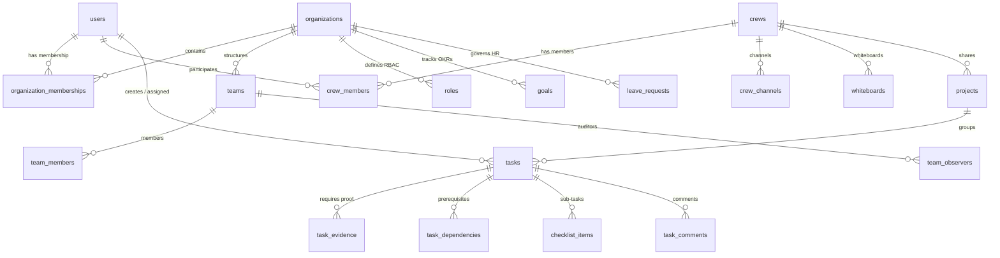

# Domain Model & Entity Catalogue

Back to **[Master Index](README.md)**

---

## 1. Tri-Modal Workspace Invariants

- **Personal Workspace Invariants**:
  - `org_id = null`, `crew_id = null`.
  - Assignable strictly to creator.
  - Lifecycle: `TODO -> IN_PROGRESS -> COMPLETED`.
  - Private notes, focus sessions, bookmarks, calendar events.
  - No personal Goals/OKRs (Goals belong to Organization mode only).

- **Crew Collaboration Invariants**:
  - `org_id = null`, `crew_id = {crewId}`.
  - Created unclaimed (`assignee = null`, status `TODO`).
  - Claimed via `POST /api/tasks/{id}/claim`.
  - Completed directly via `POST /api/tasks/{id}/complete-crew`.
  - STOMP whiteboard drawing requires active crew membership.

- **Organization Vault Invariants**:
  - `org_id = {orgId}`. Sealed corporate vault boundary.
  - Assignor priority must be `>=` assignee priority (`TaskHierarchyValidator`).
  - Review chain: `TODO -> IN_PROGRESS -> SUBMITTED -> APPROVED / REJECTED`.
  - Submitting requires non-deleted `TaskEvidence` record.
  - Assignee self-approval is strictly forbidden.
  - Enterprise projects (`project.organization != null`) cannot be shared with Crews.

---

## 2. Graphical Entity Relationship Diagram

---

## 3. Entity Catalogue & Schema Blueprint

### 1. `User` (`src/main/java/com/example/taskflow/domain/User.java`)
- **Purpose**: Global identity across all modes.
- **Fields**: `id`, `username` (Unique), `email` (Unique), `password` (BCrypt), `superAdmin` (Boolean).

### 2. `Organization` (`src/main/java/com/example/taskflow/domain/Organization.java`)
- **Purpose**: Multi-tenant enterprise vault boundary.
- **Fields**: `id`, `name`, `owner_id` (FK `users`), `active` (Boolean soft delete).

### 3. `Role` (`src/main/java/com/example/taskflow/domain/Role.java`)
- **Purpose**: Custom RBAC role with integer priority rank.
- **Fields**: `id`, `name`, `description`, `priority` (Integer 0-100), `organization_id` (FK).

### 4. `Crew` (`src/main/java/com/example/taskflow/domain/Crew.java`)
- **Purpose**: Flat peer-to-peer collaboration group.
- **Fields**: `id`, `name`, `visibility` (`PUBLIC`, `INVITE_ONLY`), `creator_id` (FK).

### 5. `Task` (`src/main/java/com/example/taskflow/domain/Task.java`)
- **Purpose**: Dynamic multi-scoped task entity.
- **Fields**: `id`, `title`, `description`, `currentStatus` (`TaskStatus`), `mode` (`TaskMode`), `assignee_id`, `creator_id`, `org_id`, `crew_id`, `project_id`, `archived`.

### 6. `TaskEvidence` (`src/main/java/com/example/taskflow/domain/TaskEvidence.java`)
- **Purpose**: Proof submitted for Org task approval.
- **Soft Delete**: `deleted`, `deletedAt`, `deletedBy`.

### 7. `Whiteboard` (`src/main/java/com/example/taskflow/domain/Whiteboard.java`)
- **Purpose**: Collaborative canvas associated with a Crew.
- **Fields**: `id`, `title`, `crew_id`, `snapshotUrl` (LONGTEXT Base64 URL).

### 8. `Goal` (`src/main/java/com/example/taskflow/domain/Goal.java`)
- **Purpose**: Corporate OKR container scoped to Organization.
- **Fields**: `id`, `title`, `description`, `status` (`GoalStatus`), `organization_id`.
