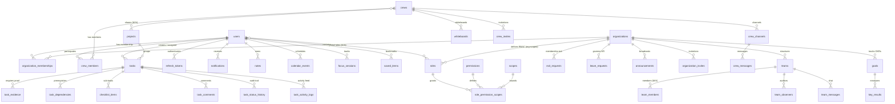

# Domain Model & Entity Catalogue

Back to **[Master Index](README.md)**

---

## 1. Tri-Modal Workspace Invariants

- **Personal Workspace Invariants**:
  - `org_id = null`, `crew_id = null`.
  - Assignable strictly to creator.
  - Lifecycle: `TODO -> IN_PROGRESS -> COMPLETED`.
  - Private notes, focus sessions, bookmarks, calendar events.
  - No personal Goals/OKRs (Goals belong to Organization mode only).
  - Personal tasks visible to creator AND members of crews with which the task's project is shared.

- **Crew Collaboration Invariants**:
  - `org_id = null`, `crew_id = {crewId}`.
  - Created unclaimed (`assignee = null`, status `TODO`).
  - Claimed via `POST /api/tasks/{id}/claim` — uses optimistic locking (`@Version`) to prevent double-claim race conditions.
  - Completed directly via `POST /api/tasks/{id}/complete-crew`.
  - No review/approval pipeline. Statuses: `TODO`, `IN_PROGRESS`, `COMPLETED`.
  - STOMP whiteboard drawing requires active crew membership.

- **Organization Vault Invariants**:
  - `org_id = {orgId}`. Sealed corporate vault boundary.
  - Assignor priority must be `>=` assignee priority (`TaskHierarchyValidator`).
  - Review chain: `TODO -> IN_PROGRESS -> SUBMITTED -> APPROVED / REJECTED`.
  - Assignee self-approval is strictly forbidden.
  - Enterprise projects (`project.organization != null`) cannot be shared with Crews.

---

## 2. Graphical Entity Relationship Diagram

```mermaid
erDiagram
    users ||--o{ organization_memberships : "has membership"
    users ||--o{ crew_members : "participates"
    users ||--o{ tasks : "creates / assigned"
    users ||--o{ refresh_tokens : "authenticates"
    users ||--o{ notifications : "receives"
    users ||--o{ notes : "owns"
    users ||--o{ calendar_events : "schedules"
    users ||--o{ focus_sessions : "tracks"
    users ||--o{ saved_items : "bookmarks"
    users }o--o{ roles : "global roles (M:N)"
    
    organizations ||--o{ organization_memberships : "contains"
    organizations ||--o{ teams : "structures"
    organizations ||--o{ roles : "defines RBAC (org-scoped)"
    organizations ||--o{ goals : "tracks OKRs"
    organizations ||--o{ exit_requests : "membership exit"
    organizations ||--o{ leave_requests : "governs HR"
    organizations ||--o{ announcements : "broadcasts"
    organizations ||--o{ organization_invites : "invitations"
    
    teams ||--o{ team_members : "members (M:N)"
    teams ||--o{ team_observers : "auditors"
    teams ||--o{ team_messages : "chat"
    
    crews ||--o{ crew_members : "has members"
    crews ||--o{ crew_channels : "channels"
    crews ||--o{ whiteboards : "whiteboards"
    crews ||--o{ crew_invites : "invitations"
    crews }o--o{ projects : "shares (M:N)"
    
    crew_channels ||--o{ crew_messages : "messages"
    
    projects ||--o{ tasks : "groups"
    
    tasks ||--o{ task_evidence : "requires proof"
    tasks ||--o{ task_dependencies : "prerequisites"
    tasks ||--o{ checklist_items : "sub-tasks"
    tasks ||--o{ task_comments : "comments"
    tasks ||--o{ task_status_history : "audit trail"
    tasks ||--o{ task_activity_logs : "activity feed"
    
    goals ||--o{ key_results : "measures"
    
    roles ||--o{ role_permission_scopes : "grants"
    permissions ||--o{ role_permission_scopes : "defines"
    scopes ||--o{ role_permission_scopes : "bounds"
```

---

## 3. Entity Catalogue & Schema Blueprint

### Core Identity

#### `User` (`user/domain/User.java`)
- **Purpose**: Global identity across all workspace modes.
- **Fields**: `id`, `username` (unique), `email` (unique), `password` (BCrypt-12), `fullName`, `bio`, `avatarUrl`, `manager` (FK → User), `emailVerified` (boolean), `emailNotificationsEnabled` (boolean), `tokenVersion` (int, for mass JWT invalidation), `lastLoginAt`, `lastLoginIp`, `lastLoginUserAgent`, `createdAt`.
- **Derived Methods**: `isSuperAdmin()` (checks if `roles` contains `"SUPER_ADMIN"`), `isMemberOf(Organization org)`.
- **Relationships**: ManyToMany → `Role`, OneToMany → `OrganizationMembership`, `RefreshToken`, `Notification`, `Note`, `CalendarEvent`, `FocusSession`, `SavedItem`.

#### `Role` (`organization/rbac/domain/Role.java`)
- **Purpose**: Custom RBAC role with integer priority rank, scoped to organization or global.
- **Fields**: `id`, `name`, `description`, `priority` (int, lower = higher authority), `builtin` (boolean), `organization` (FK, nullable for global roles), `createdAt`.
- **Helper Methods**: `isBuiltinAdmin()`, `isBuiltinDirectorOrAbove()`, `isBuiltinManagerOrAbove()`.
- **Relationships**: OneToMany → `RolePermissionScope`, ManyToOne → `Organization`.

#### `Permission` (`organization/rbac/domain/Permission.java`)
- **Purpose**: Granular permission tokens (19 types defined in `PermissionType` enum).
- **Fields**: `id`, `name` (unique), `description`.

### Authentication

#### `RefreshToken` (`identity/domain/RefreshToken.java`)
- **Purpose**: Persistent refresh token for single-use JWT rotation with replay detection.
- **Fields**: `id`, `tokenHash` (SHA-256 of raw token), `tokenId` (UUID), `user` (FK → User), `expiryDate`, `used` (boolean), `usedAt`, `deviceInfo` (User-Agent), `createdAt`.

#### `PasswordResetToken` (`identity/domain/PasswordResetToken.java`)
- **Purpose**: One-time-use password reset token.
- **Fields**: `id`, `token`, `userId`, `expiryDate` (1 hour), `used` (boolean).

### Organization Domain

#### `Organization` (`organization/core/domain/Organization.java`)
- **Purpose**: Multi-tenant enterprise vault boundary.
- **Fields**: `id`, `name`, `slug` (unique), `description`, `status` (`OrgStatus` enum: `ACTIVE`, `SUSPENDED`, `DELETED`), `createdBy` (FK → User), `createdAt`.
- **Domain Methods**: `requireActive()`, `ensureNotLastAdmin(User user)`.
- **Relationships**: OneToMany → `OrganizationMembership`, `Team`, `Role`.

#### `OrganizationMembership` (`organization/membership/domain/OrganizationMembership.java`)
- **Purpose**: Join table linking users to organizations with a specific org role.
- **Fields**: `id`, `joinedAt`.
- **Relationships**: ManyToOne → `User`, `Organization`, `Role` (orgRole, EAGER fetch).

#### `Team` (`team/domain/Team.java`)
- **Purpose**: Sub-group within an organization for team-based task scoping.
- **Fields**: `id`, `name`, `slug`.
- **Relationships**: ManyToOne → `Organization`, OneToMany → `TeamMember` (members).

#### `TeamMember` (`team/domain/TeamMember.java`)
- **Purpose**: Explicit join table linking users to teams within an organization.
- **Key**: Composite (`teamId`, `userId` via `TeamMemberId`).
- **Fields**: `joinedAt`.
- **Relationships**: ManyToOne → `Team`, `User`.

#### `TeamObserver` (`team/domain/TeamObserver.java`)
- **Purpose**: Read-only auditor role on a team. Vetoed from all write operations.
- **Key**: Composite (`teamId`, `userId`).

#### `TeamMessage` (`team/domain/TeamMessage.java`)
- **Purpose**: Chat messages within organization teams.
- **Fields**: `id`, `content`, `createdAt`.
- **Relationships**: ManyToOne → `Team`, `User` (author).

#### `OrganizationInvite` (`organization/membership/domain/OrganizationInvite.java`)
- **Purpose**: In-app invite or shareable link for org membership.
- **Fields**: `id`, `status` (`PENDING`/`ACCEPTED`/`DECLINED`/`EXPIRED`), `token` (UUID for link-based invites).
- **Relationships**: ManyToOne → `Organization`, `User` (inviter, invitee), `Role`.

#### LeaveRequest (organization/membership/domain/LeaveRequest.java)
- **Purpose**: Workforce absence management with approval workflow.
- **Fields**: `id`, `leaveType` (VARCHAR(30)), `reason`, `startDate`, `endDate`, `workingDays`, `calendarDays`, `isHalfDay`, `isEmergency`, `attachmentUrl`, `status` (`PENDING`/`APPROVED`/`REJECTED`), `adminComment`.
- **Relationships**: ManyToOne → `Organization`, `User` (requester), `User` (reviewer).
- **Note**: As of V55, the legacy `leave_requests` table is deprecated in favor of the dedicated `employee_leave_requests` table.

#### ExitRequest (organization/membership/domain/ExitRequest.java)
- **Purpose**: Organization membership termination request (member exits organization).
- **Fields**: `id`, `reason`, `status` (`PENDING`/`APPROVED`/`REJECTED`), `decisionComment`, `requestedAt`, `reviewedAt`, `effectiveExitDate`.
- **Relationships**: ManyToOne → `Organization`, `User` (requester), `User` (reviewer).
- **Introduced**: V55 migration — separates membership lifecycle (exit) from workforce absence (leave).
#### `Announcement` (`organization/announcement/domain/Announcement.java`)
- **Purpose**: Organization-wide broadcast messages.
- **Fields**: `id`, `title`, `content`, `pinned` (boolean).
- **Relationships**: ManyToOne → `Organization`, `User` (author).

#### `Goal` (`goal/domain/Goal.java`)
- **Purpose**: Corporate OKR container scoped to Organization.
- **Fields**: `id`, `title`, `description`, `status` (`NOT_STARTED`, `IN_PROGRESS`, `AT_RISK`, `COMPLETED`), `startDate`, `endDate`.
- **Relationships**: ManyToOne → `Organization`, `User` (owner), OneToMany → `KeyResult`.

#### `KeyResult` (`goal/domain/KeyResult.java`)
- **Purpose**: Measurable outcome linked to a Goal.
- **Fields**: `id`, `title`, `currentValue`, `targetValue`, `unit`.
- **Relationships**: ManyToOne → `Goal`.

### Task Domain

#### `Task` (`task/domain/model/Task.java`)
- **Purpose**: Dynamic multi-scoped task entity — the central business object.
- **Fields**: `id`, `title`, `description`, `currentStatus` (`TaskStatus` enum), `priority` (`TaskPriority` enum), `dueDate`, `tags`, `archived`, `personal` (boolean), `mode` (`TaskMode` enum — `@Transient` property derived from `personal`/`crew`/`organization`), `rejectionReason`, `locked` (boolean), `coverImageUrl`, `approvedBy`, `version` (`@Version` — optimistic locking).
- **Relationships**: ManyToOne → `User` (creator, assignee, reviewer), `Organization`, `Team`, `Crew`, `Project`. OneToMany → `TaskComment`, `ChecklistItem`, `TaskEvidence`, `TaskDependency`, `TaskStatusHistory`, `TaskActivityLog`.

#### `TaskEvidence` (`task/domain/model/TaskEvidence.java`)
- **Purpose**: Polymorphic proof submitted for task review (soft-deletable for audit continuity).
- **Fields**: `id`, `version` (`@Version`), `type` (`EvidenceType` enum: `LINK`, `GITHUB`, `SCREENSHOT`, `RECORDING`, `SNIPPET`, `NOTE`), `title`, `url`, `unfurlJson` (JSONB), `ghRepo`, `ghPrNo`, `ghCommit`, `ghState`, `imageKey`, `imageW`, `imageH`, `videoUrl`, `durationS`, `codeLang`, `codeBody`, `noteMd`, `createdAt`, `deleted` (boolean), `deletedAt`.
- **Relationships**: ManyToOne → `Task`, `User` (addedBy, deletedBy).

#### `TaskComment` (`task/domain/model/TaskComment.java`)
- **Purpose**: Threaded comments on tasks.
- **Fields**: `id`, `comment` (text), `createdAt`, `updatedAt`.
- **Relationships**: ManyToOne → `Task`, `User` (author), `TaskComment` (parent self-reference), OneToMany → `TaskComment` (replies).

#### `ChecklistItem` (`task/domain/model/ChecklistItem.java`)
- **Purpose**: Sub-task checklist items within a task.
- **Fields**: `id`, `text`, `isCompleted` (boolean), `displayOrder`, `deleted` (boolean), `completedAt`, `version` (`@Version`).
- **Relationships**: ManyToOne → `Task`, `User` (createdBy).

#### `TaskDependency` (`task/domain/model/TaskDependency.java`)
- **Purpose**: Prerequisite relationships between tasks using a composite primary key.
- **Fields**: `id` (`TaskDependencyId`: `taskId` + `dependsOnId`), `createdAt`.
- **Relationships**: ManyToOne → `Task` (task), `Task` (dependsOn), `User` (createdBy).

#### `TaskStatusHistory` (`task/domain/model/TaskStatusHistory.java`)
- **Purpose**: Immutable audit trail of task status transitions.
- **Fields**: `id`, `fromStatus`, `toStatus`, `changedAt`, `taskTitleSnapshot`, `actorUsernameSnapshot`.
- **Relationships**: ManyToOne → `Task`, `User` (changedBy).

### Crew Domain

#### `Crew` (`crew/domain/Crew.java`)
- **Purpose**: Flat peer-to-peer collaboration group.
- **Fields**: `id`, `name`, `slug` (unique), `description`, `avatarUrl`, `visibility` (`CrewVisibility` enum: `INVITE_ONLY`, `PUBLIC_LINK`, `PUBLIC`), `memberCap` (int, default 15), `createdAt`, `updatedAt`.
- **Relationships**: ManyToOne → `User` (creator), OneToMany → `CrewMember`, `CrewChannel`, `CrewInvite`, ManyToMany → `Project` (sharedProjects).

#### `CrewMember` (`crew/domain/CrewMember.java`)
- **Key**: Composite (`crewId`, `userId`).
- **Fields**: `role` (`OWNER`/`MEMBER`), `joinedAt`.

#### `CrewChannel` (`crew/domain/CrewChannel.java`)
- **Fields**: `id`, `name`, `type` (`TEXT`/`VOICE`), `position`.
- **Relationships**: ManyToOne → `Crew`, OneToMany → `CrewMessage`.

#### `CrewMessage` (`crew/domain/CrewMessage.java`)
- **Fields**: `id`, `content`, `editedAt` (null if never edited).
- **Relationships**: ManyToOne → `CrewChannel`, `User` (author), `Task` (optional linked task).

#### `CrewInvite` (`crew/domain/CrewInvite.java`)
- **Fields**: `id` (UUID), `email`, `status` (`PENDING`/`ACCEPTED`/`EXPIRED`), `expiresAt`.
- **Relationships**: ManyToOne → `Crew`, `User` (inviter, invitee).

### Project Domain

#### `Project` (`project/domain/Project.java`)
- **Purpose**: Task grouping mechanism across all three task modes.
- **Fields**: `id`, `name`, `description`, `color`, `dueDate`, `scope` (`ProjectScope` enum: `PERSONAL`, `CREW`, `ORGANIZATION`), `status` (`ProjectStatus` enum: `ACTIVE`, `COMPLETED`, `ARCHIVED`), `deleted` (boolean), `version` (`@Version`), `createdAt`, `updatedAt`.
- **Relationships**: ManyToOne → `User` (ownerUser, createdBy), `Organization`, `Team`, `Crew`. ManyToMany → `Crew` (sharedCrews), `User` (collaborators).

#### `Whiteboard` (`whiteboard/Whiteboard.java`)
- **Purpose**: Collaborative canvas for real-time drawing within a Crew.
- **Fields**: `id`, `title`, `snapshotDataUrl` (Base64 data URL durability snapshot), `createdAt`, `updatedAt`.
- **Relationships**: ManyToOne → `Crew`, `User` (createdBy).

### Productivity Domain

#### `FocusSession` (`focus/FocusSession.java`)
- **Fields**: `id`, `startTime`, `endTime`, `durationMinutes`, `mode` (`FOCUS`/`SHORT_BREAK`/`LONG_BREAK`).
- **Relationships**: ManyToOne → `User`, `Task` (optional).

#### `CalendarEvent` (`calendar/CalendarEvent.java`)
- **Fields**: `id`, `title`, `description`, `startTime`, `endTime`, `allDay`.
- **Relationships**: ManyToOne → `User`.

#### `Note` (`note/Note.java`)
- **Fields**: `id`, `title`, `content`.
- **Relationships**: ManyToOne → `User`.

#### `SavedItem` (`saveditem/SavedItem.java`)
- **Purpose**: Polymorphic bookmarking for user-saved entities.
- **Fields**: `id`, `entityType` (`SavedEntityType` enum: `TASK`, `PROJECT`, `NOTE`, `ORGANIZATION`, `TEAM`), `entityId` (Long), `savedAt`.
- **Relationships**: ManyToOne → `User`.

### Notification Domain

#### `Notification` (`notification/domain/Notification.java`)
- **Fields**: `id`, `type` (`NotificationEvent` enum — 24 event types), `title`, `message`, `taskId`, `taskTitleSnapshot`, `metadata` (JSONB), `read` (boolean), `createdAt`, `deduplicationKey`.
- **Relationships**: ManyToOne → `User` (recipient), `User` (actor).

### Audit Domain

#### `AuditEvent` (`domain/AuditEvent.java`)
- **Fields**: `id`, `eventType`, `entityType`, `entityId`, `oldValueJson` (JSONB), `newValueJson` (JSONB), `reason`, `occurredAt`.
- **Relationships**: ManyToOne → `User` (actor).

#### `SecurityAuditEvent` (`domain/SecurityAuditEvent.java`)
- **Fields**: `id`, `eventType`, `ipAddress`, `deviceInfo`, `metadataJson` (JSONB), `occurredAt`, `success` (boolean).
- **Relationships**: ManyToOne → `User` (actor).

#### `TaskActivityLog` (`task/domain/model/TaskActivityLog.java`)
- **Fields**: `id`, `actionType`, `entityType`, `entityId`, `metadataJson` (JSONB), `source` (`AuditEventSource` enum), `ipAddress`, `userAgent`, `correlationId`, `createdAt`.
- **Relationships**: ManyToOne → `Task`, `User` (actor).

#### `ProjectActivityLog` (`project/domain/ProjectActivityLog.java`)
- **Fields**: `id`, `actionType`, `entityType`, `entityId`, `metadataJson` (JSONB), `source` (`AuditEventSource` enum), `ipAddress`, `userAgent`, `correlationId`, `createdAt`.
- **Relationships**: ManyToOne → `Project`, `User` (actor).

### Outbox Event Domain

#### `OutboxEvent` (`domain/OutboxEvent.java`)
- **Fields**: `id`, `aggregateType`, `aggregateId`, `eventType`, `payload` (JSONB), `status` (`OutboxStatus` enum), `createdAt`, `processedAt`, `retryCount`, `lastError`.
- **Purpose**: Persisted atomically within domain transactions to guarantee reliable asynchronous event publishing via the Outbox Poller.

### Additional Enums Reference

- `ProjectScope`: `PERSONAL`, `CREW`, `ORGANIZATION`
- `ProjectCollaboratorRole`: `VIEWER`, `EDITOR`, `ADMIN`
- `AuditEventSource`: `API`, `SYSTEM`, `SCHEDULER`, `IMPORT`, `WEBSOCKET`, `MIGRATION`, `WEBHOOK`
- `OutboxStatus`: `PENDING`, `PROCESSED`, `FAILED`

### Domain Events (Spring ApplicationEvents)

| Event Class | File | Published When |
| :--- | :--- | :--- |
| `TaskStatusChangedEvent` | `domain/events/task/TaskStatusChangedEvent.java` | Task status transitions |
| `EvidenceUploadedEvent` | `domain/events/task/EvidenceUploadedEvent.java` | Evidence added to a task |
| `NotificationCreatedEvent` | `notification/NotificationCreatedEvent.java` | Notification persisted — triggers WebSocket push |

---

## 4. Concurrency Control

Four entities use `@Version` for optimistic locking. Concurrent modifications cause `OptimisticLockingFailureException` → HTTP `409 Conflict` (code: `OPTIMISTIC_LOCK_CONFLICT`):

| Entity | Field | Reason |
| :--- | :--- | :--- |
| `Task` | `version` | Prevents concurrent status updates and edits |
| `Project` | `version` | Prevents concurrent project metadata updates |
| `ChecklistItem` | `version` | Prevents concurrent checklist toggling |
| `TaskEvidence` | `version` | Prevents concurrent evidence mutations |

The crew task claim flow explicitly catches `OptimisticLockingFailureException` and converts it to `IllegalStateException("Task already claimed")`.

