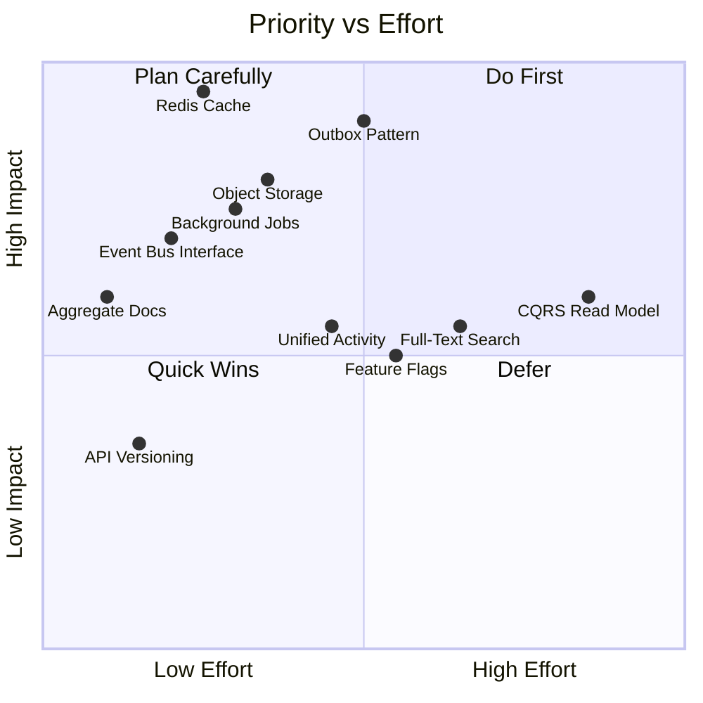

# Future Architecture & Evolution Roadmap

Back to **[Master Index](README.md)** | View **[Architecture Overview](architecture.md)**

---

This document captures architectural improvements identified during code review and architecture audit. Each item is ordered by priority and impact. Items are categorized as **immediate** (should be done before production), **near-term** (first 6 months), or **strategic** (6–18 months).

---

## 1. Event Bus Abstraction — `DomainEventPublisher` Interface

**Priority**: Complete (Implemented in v1.5.0) | **Impact**: High | **Effort**: Low

### Implemented State (✅ Verified)
Business services publish domain events through the `DomainEventPublisher` interface, decoupled from Spring's `ApplicationEventPublisher`:

```java
// Interface abstraction (com.example.taskflow.event.DomainEventPublisher)
public interface DomainEventPublisher {
    void publish(Object event);
}

// Spring implementation (com.example.taskflow.event.SpringDomainEventPublisher)
@Component
public class SpringDomainEventPublisher implements DomainEventPublisher {
    private final ApplicationEventPublisher applicationEventPublisher;
    public void publish(Object event) {
        if (event != null) applicationEventPublisher.publishEvent(event);
    }
}
```

### Why It Matters
- Swapping from Spring Events → Kafka / RabbitMQ / Transactional Outbox Pattern requires modifying only one component implementation.
- Business services (`NotificationService`, `TaskStateTransitionServiceImpl`, `TaskEvidenceService`) are 100% decoupled from Spring's event bus infrastructure.
- Enables seamless event broker migration without altering domain logic.

---

## 2. Outbox Pattern for Reliable Event Delivery

**Priority**: Complete (Implemented in v1.5.0) | **Impact**: Critical | **Effort**: Medium

### Implemented Architecture (✅ Verified)

```
Service Method
  └── DB Transaction
       ├── Business Write
       └── INSERT INTO outbox_events (event_type, payload, status='PENDING')
       └── COMMIT (atomic — both succeed or both fail)

OutboxPoller (Background Scheduler)
  └── SELECT * FROM outbox_events WHERE status='PENDING' ORDER BY created_at
       ├── Dispatch to ApplicationEventPublisher
       ├── UPDATE status='PROCESSED'
       └── On failure: UPDATE status='FAILED', retry_count++
```

### Components Created
1. `Flyway V47__create_outbox_events_table.sql`: Database schema for atomic event persistence.
2. `OutboxEvent.java`: JPA Entity for outbox tracking.
3. `OutboxEventRepository.java`: Spring Data repository for pending outbox events.
4. `OutboxDomainEventPublisher.java`: Pluggable `DomainEventPublisher` active when `app.events.publisher=outbox`.
5. `OutboxPoller.java`: `@Scheduled` polling background service with automatic retry handling.

### Benefits
- **Zero event loss**: Events are committed atomically within the same DB transaction as business writes.
- **Pluggable & Toggleable**: Switch between direct Spring events (`app.events.publisher=spring`) and Transactional Outbox (`app.events.publisher=outbox`) with a single configuration flag.
- **Retryable & Auditable**: Failed events are retried up to 3 times with status audit history.

---

## 3. Full-Text Search Infrastructure

**Priority**: Strategic | **Impact**: Medium | **Effort**: Medium

### Current State (✅ Verified)
All search queries use JPA repository methods with `LIKE` or specification-based filtering against PostgreSQL. This works for current data volumes but will degrade as data grows.

### When to Migrate
Consider search infrastructure when any of these thresholds are reached:
- Task count > 100,000 per organization
- Search response time > 200ms at p95
- Users request cross-entity search (tasks + comments + evidence + notes)

### Recommended Stack

| Option | Best For | Integration Effort |
| :--- | :--- | :--- |
| **PostgreSQL Full-Text Search** (`tsvector`) | Low-volume, single-entity search | Low — no new infrastructure |
| **Meilisearch** | Fast typo-tolerant search, small teams | Medium — simple REST API |
| **OpenSearch / Elasticsearch** | High-volume, faceted, cross-entity search | High — requires cluster management |

### Architecture Pattern
```
Write Path:  Service → DB → Domain Event → Search Indexer → Search Engine
Read Path:   Controller → Search Engine → Return IDs → DB Hydration (optional)
```

---

## 4. Object Storage for Task Evidence

**Priority**: Near-Term | **Impact**: High | **Effort**: Low

### Current State (✅ Verified)
`TaskEvidence` stores file metadata (`fileUrl`, `fileName`, `fileType`, `fileSizeBytes`) in the database. Actual file storage mechanism depends on deployment configuration.

### Recommended Architecture

```
Upload Flow:
  Client → Controller → Generate Pre-Signed Upload URL (S3/MinIO)
  Client → S3 Direct Upload (bypasses backend)
  Client → Controller → Save metadata (fileUrl = S3 key) to DB

Download Flow:
  Client → Controller → Generate Pre-Signed Download URL (60min TTL)
  Client → S3 Direct Download (bypasses backend)
```

### Benefits
- Backend never handles file bytes — reduces memory pressure and thread pool contention.
- Pre-signed URLs provide time-limited, tamper-proof access.
- S3-compatible storage (AWS S3, MinIO, Cloudflare R2) is horizontally scalable.
- Virus scanning can be added as an S3 event trigger (Lambda + ClamAV).

---

## 5. Distributed Cache (Redis)

**Priority**: Immediate (before multi-node deployment) | **Impact**: Critical | **Effort**: Low

### Current State (✅ Verified, documented in [operations.md](operations.md) KI-1, KI-2)
Three components use Caffeine (in-memory, single-node):

| Component | Data | Risk if Not Migrated |
| :--- | :--- | :--- |
| `TokenDenylistService` | Revoked JWT access tokens | Revoked tokens accepted on other nodes |
| `RateLimitFilter` | Bucket4j rate limit buckets | Rate limits not shared across nodes |
| `AuthController` | Per-endpoint rate limit buckets | Same as above |

### Recommended Migration
```java
// Before (Caffeine)
Cache<String, Boolean> denylist = Caffeine.newBuilder()
    .expireAfterWrite(15, TimeUnit.MINUTES).build();

// After (Redis via Spring Data Redis)
@Bean
public RedisTemplate<String, Boolean> denylistTemplate(RedisConnectionFactory factory) {
    RedisTemplate<String, Boolean> template = new RedisTemplate<>();
    template.setConnectionFactory(factory);
    return template;
}
```

### Priority
This is the **#1 blocker** for horizontal scaling. Must be resolved before deploying behind a load balancer with multiple instances.

---

## 6. Domain Aggregate Boundaries

**Priority**: Near-Term (documentation) | **Impact**: High | **Effort**: Documentation only

### Why Document Aggregates
Aggregate boundaries define which entities can be modified together in a single transaction. Without explicit boundaries, developers accidentally create cross-aggregate mutations that break consistency guarantees.

### Defined Aggregates

```
┌─────────────────────────────────────┐
│         TASK AGGREGATE              │
│  ┌─────────────────────────────┐    │
│  │ Task (Root)                 │    │
│  │  ├── ChecklistItem[]       │    │
│  │  ├── TaskEvidence[]        │    │
│  │  ├── TaskComment[]         │    │
│  │  ├── TaskDependency[]      │    │
│  │  └── TaskStatusHistory[]   │    │
│  └─────────────────────────────┘    │
│  Rule: All child entities are       │
│  modified through TaskService.      │
│  Never modify ChecklistItem         │
│  without loading the parent Task.   │
└─────────────────────────────────────┘

┌─────────────────────────────────────┐
│       PROJECT AGGREGATE             │
│  ┌─────────────────────────────┐    │
│  │ Project (Root)              │    │
│  │  ├── Collaborators[] (M:N)  │    │
│  │  └── SharedCrews[] (M:N)    │    │
│  └─────────────────────────────┘    │
│  Rule: Tasks reference Project      │
│  by FK but are NOT part of this     │
│  aggregate. Task.project_id is a    │
│  cross-aggregate reference.         │
└─────────────────────────────────────┘

┌─────────────────────────────────────┐
│     ORGANIZATION AGGREGATE          │
│  ┌─────────────────────────────┐    │
│  │ Organization (Root)         │    │
│  │  ├── Role[]                 │    │
│  │  │    └── Permission[] (M:N)│    │
│  │  ├── Team[]                 │    │
│  │  │    ├── TeamMember[]      │    │
│  │  │    └── TeamObserver[]    │    │
│  │  ├── OrganizationMembership│    │
│  │  ├── Announcement[]        │    │
│  │  ├── Goal[]                 │    │
│  │  │    └── KeyResult[]       │    │
│  │  └── LeaveRequest[]         │    │
│  └─────────────────────────────┘    │
│  Rule: Cross-org references are     │
│  forbidden. Task.org_id is a        │
│  cross-aggregate FK reference.      │
└─────────────────────────────────────┘

┌─────────────────────────────────────┐
│         CREW AGGREGATE              │
│  ┌─────────────────────────────┐    │
│  │ Crew (Root)                 │    │
│  │  ├── CrewMember[]           │    │
│  │  ├── CrewChannel[]          │    │
│  │  │    └── CrewMessage[]     │    │
│  │  ├── CrewInvite[]           │    │
│  │  └── Whiteboard[]           │    │
│  └─────────────────────────────┘    │
│  Rule: Whiteboard strokes are       │
│  broadcast without DB writes.       │
│  Only snapshots persist.            │
└─────────────────────────────────────┘

┌─────────────────────────────────────┐
│         USER AGGREGATE              │
│  ┌─────────────────────────────┐    │
│  │ User (Root)                 │    │
│  │  ├── RefreshToken[]         │    │
│  │  ├── Note[]                 │    │
│  │  ├── FocusSession[]         │    │
│  │  ├── CalendarEvent[]        │    │
│  │  ├── SavedItem[]            │    │
│  │  └── Notification[]         │    │
│  └─────────────────────────────┘    │
│  Rule: User.tokenVersion controls   │
│  mass JWT invalidation. Incrementing│
│  it is a User aggregate operation.  │
└─────────────────────────────────────┘
```

### Cross-Aggregate Reference Rules
1. **Task → Project**: FK reference only. Deleting a project sets `task.project_id = null` (soft detachment, not cascade).
2. **Task → Organization**: FK reference only. Task inherits org context but is not part of the Organization aggregate.
3. **Task → Crew**: Same as above.
4. **Project → Crew (shared)**: M:N join table. Sharing/unsharing is a Project aggregate operation.
5. **OrganizationMembership → User**: Cross-aggregate join. User exists independently of any organization.

---

## 7. Read Model / CQRS for Analytics

**Priority**: Strategic | **Impact**: Medium | **Effort**: High

### Problem
As data grows, read-heavy endpoints will become bottlenecks:

| Endpoint | Current Implementation | Scaling Concern |
| :--- | :--- | :--- |
| `GET /api/dashboard/stats` | Aggregate queries on `tasks` table | Full table scans with complex filters |
| `GET /api/notifications` | Query `notifications` table | High cardinality per user |
| `GET /api/organizations/{orgId}/workload` | Cross-join tasks × memberships | O(members × tasks) |
| Calendar view | Query `calendar_events` + task due dates | Date range scans across two tables |

### Recommended Future Architecture (CQRS Lite)
```
Command Side (current):
  Controller → Service → Repository → PostgreSQL (write)

Read Side (new):
  Domain Event → Projection Builder → Read Model (materialized view / denormalized table)
  Dashboard Controller → Read Model (fast read)
```

### When to Implement
- When `DashboardService` queries exceed 100ms at p95.
- When notification count per user exceeds 10,000.
- Start with PostgreSQL materialized views before introducing a separate read database.

---

## 8. API Versioning

**Priority**: Complete (Implemented in v1.5.0) | **Impact**: High | **Effort**: Low

### Current State
All endpoints across 35 REST controllers are versioned with the `/api/v1/` prefix: `/api/v1/tasks`, `/api/v1/organizations`, `/api/v1/auth`, etc.

### Benefits
- Breaking changes can be introduced in `/api/v2` in the future without disrupting existing `v1` clients.
- Mobile apps and frontend SPAs can rely on stable, versioned API contracts.
- Prevents breaking client integrations when domain models evolve.

### Evolution Strategy
1. Future breaking changes should be exposed under `/api/v2/` namespace.
2. Legacy `/api/v1/` controllers can be deprecated gracefully when `v2` endpoints are published.

---

## 9. Feature Flags

**Priority**: Strategic | **Impact**: Medium | **Effort**: Medium

### Current State
Feature availability is controlled by role checks and hardcoded conditionals.

### Recommended Approach

```java
// Simple — configuration-based (Phase 1)
@Value("${features.whiteboard-v2.enabled:false}")
private boolean whiteboardV2Enabled;

// Advanced — database-backed with per-org targeting (Phase 2)
if (featureFlagService.isEnabled("whiteboard-v2", currentOrg)) {
    // new behavior
}
```

### Use Cases
| Flag | Purpose |
| :--- | :--- |
| `evidence-virus-scan` | Enable ClamAV scanning before evidence upload |
| `websocket-redis-broker` | Toggle between in-memory and Redis WS broker |
| `notification-email-digest` | Send daily digest instead of per-event emails |
| `api-v2` | Route to v2 controllers for selected orgs |

---

## 10. Background Job Scheduler

**Priority**: Near-Term | **Impact**: High | **Effort**: Low

### Current State (✅ Verified)
`@EnableScheduling` is configured in `AsyncConfig`, but no `@Scheduled` methods are currently implemented beyond the async executors.

### Jobs Needed

| Job | Schedule | Description |
| :--- | :--- | :--- |
| `ExpiredInviteCleanup` | Daily 02:00 UTC | Delete `OrganizationInvite` and `CrewInvite` where `status=PENDING` and `expiresAt < now()` |
| `ExpiredRefreshTokenCleanup` | Daily 03:00 UTC | Delete `RefreshToken` where `expiresAt < now()` |
| `ExpiredPasswordResetCleanup` | Hourly | Delete `PasswordResetToken` where `expiryDate < now()` or `used = true` |
| `NotificationArchival` | Weekly | Archive `Notification` older than 90 days to cold storage or delete |
| `SoftDeleteCleanup` | Weekly | Hard-delete `TaskEvidence` where `deleted = true` and `deletedAt < 30 days ago` |
| `ReminderEmails` | Every 15 min | Send reminder for tasks approaching `dueDate` (24h, 1h thresholds) |

### Recommended Stack

| Option | Complexity | Distributed Support |
| :--- | :--- | :--- |
| Spring `@Scheduled` | Low | ❌ No (runs on every node) |
| **ShedLock** + Spring `@Scheduled` | Low | ✅ Yes (distributed lock via DB/Redis) |
| Quartz Scheduler | Medium | ✅ Yes (built-in clustering) |
| JobRunr | Medium | ✅ Yes (dashboard included) |

For the current architecture, **ShedLock** is the recommended starting point — minimal code change, prevents duplicate execution across nodes.

---

## 11. Unified Activity Log (Design Consideration)

**Priority**: Near-Term | **Impact**: Medium | **Effort**: Medium

### Current State (✅ Verified)
Two separate activity log tables exist with nearly identical schemas:

| Table | Entity | File |
| :--- | :--- | :--- |
| `task_activity_logs` | `TaskActivityLog` | `domain/TaskActivityLog.java` |
| `project_activity_logs` | `ProjectActivityLog` | `domain/ProjectActivityLog.java` |

Both contain: `actionType`, `entityType`, `entityId`, `metadataJson`, `source`, `ipAddress`, `userAgent`, `correlationId`.

### Option A: Unified Table (Recommended for Simplicity)

```sql
CREATE TABLE activity_logs (
    id              BIGSERIAL PRIMARY KEY,
    entity_type     VARCHAR(50) NOT NULL,  -- 'TASK', 'PROJECT', 'ORGANIZATION', 'CREW', 'GOAL'
    entity_id       BIGINT NOT NULL,
    action_type     VARCHAR(100) NOT NULL,
    actor_id        BIGINT REFERENCES users(id),
    metadata_json   JSONB,
    source          VARCHAR(50),
    ip_address      VARCHAR(45),
    user_agent      TEXT,
    correlation_id  VARCHAR(64),
    created_at      TIMESTAMP DEFAULT NOW(),
    INDEX idx_activity_entity (entity_type, entity_id),
    INDEX idx_activity_actor (actor_id),
    INDEX idx_activity_created (created_at)
);
```

**Advantages**: Single audit infrastructure for all entity types. New entities (Goal, LeaveRequest, Crew) get activity logging for free. Single query for "show me everything User X did today."

**Trade-off**: Table grows faster. Requires partitioning by `created_at` for high-volume deployments.

### Option B: Keep Separate Tables (Current)

**Advantages**: Each table stays smaller. Different indexes optimized per access pattern. No risk of cross-entity query interference.

**Trade-off**: Duplicated schema, duplicated service logic, each new entity type requires a new table + repository + service.

### Recommendation
Unify if you expect to add activity logging to more entity types (Goal, Organization, Crew, Announcement). Keep separate if Task and Project will remain the only audited entities.

---

## Priority Matrix



| Phase | Items | Timeline |
| :--- | :--- | :--- |
| **Immediate** | Redis Cache (#5), API Versioning (#8) | Before production |
| **Near-Term** | Event Bus (#1), Background Jobs (#10), Object Storage (#4), Aggregate Docs (#6), Unified Activity (#11) | 0–6 months |
| **Strategic** | Outbox Pattern (#2), Search (#3), CQRS (#7), Feature Flags (#9) | 6–18 months |
