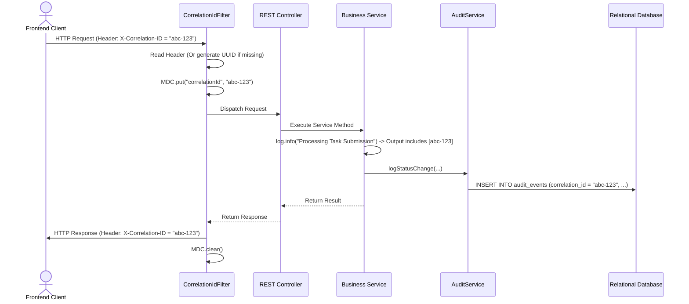

# Operations, Runbooks & Known Issues

Back to **[Master Index](README.md)**

---

## 1. Application Configuration Blueprint (`src/main/resources/application.yml`)

```yaml
server:
  port: 8080
  servlet:
    context-path: /

spring:
  datasource:
    url: ${DB_URL:jdbc:mysql://localhost:3306/taskflow?useSSL=false&allowPublicKeyRetrieval=true}
    username: ${DB_USERNAME:root}
    password: ${DB_PASSWORD:<REPLACE_WITH_SECURE_DB_PASSWORD>}
    hikari:
      maximum-pool-size: 20
      minimum-idle: 5
  jpa:
    hibernate:
      ddl-auto: validate
    show-sql: false
    properties:
      hibernate.format_sql: true

app:
  jwt:
    secret: ${JWT_SECRET:<REPLACE_WITH_SECURE_256BIT_SECRET>}
    expiration-ms: 900000 # 15 minutes
    refresh-expiration-ms: 604800000 # 7 days
  rate-limit:
    capacity: 100
    tokens-per-minute: 60
```

---

## 2. Diagram 10: Trace ID MDC Logging Lifecycle



---

## 3. Operational Runbooks

### Runbook 1: Rotating JWT Secret Key
1. Generate a new 256-bit cryptographically random base64 secret key.
2. Update the environment variable `JWT_SECRET` in the target deployment environment (Kubernetes Secret / Environment file).
3. Perform a zero-downtime rolling restart of the application instances.
4. Active short-lived JWT tokens will expire within 15 minutes. Users with active refresh tokens will seamlessly refresh and receive tokens signed with the new key.

### Runbook 2: Database Schema Migration & DDL Management
1. Ensure Spring JPA DDL auto is set to `validate` in production (`spring.jpa.hibernate.ddl-auto: validate`).
2. Apply DDL migration scripts via SQL scripts or version control tool (Flyway / Liquibase) prior to deploying new container revisions.
3. Validate column constraints, index additions, and foreign key definitions against entity annotations.

### Runbook 3: Disaster Recovery & Backup Restoration
1. Relational Database: Schedule automated daily full snapshots and continuous WAL (Write-Ahead Logging) point-in-time recovery.
2. Evidence File Storage: Sync local evidence upload directories to remote offsite object storage.
3. Restoration Verification: Test database restoration onto a staging instance quarterly.

---

## 4. Known Issues, Limitations & Workarounds

| Category | Known Limitation / Issue | Impact / Workaround | Recommended Resolution |
| :--- | :--- | :--- | :--- |
| **Rate Limiting** | Bucket4j buckets reside in local memory | Single-node only; multi-node clusters will not share bucket counts | Migrate Bucket4j storage back-end to Redis |
| **Email Dispatch** | SMTP emails sent synchronously on registration/invites | Potential latency spike if SMTP provider experiences delays | Wrap `EmailService` calls in `@Async` or Kafka queue |
| **File Malware** | Uploaded evidence files are saved without binary virus scan | Potential risk of storing infected files | Integrate ClamAV scanning daemon prior to disk write |
| **STOMP Scale** | Whiteboard draw streams broadcast in-memory | WebSocket connections tied to single node | Add Redis pub/sub broker relay for multi-node WS |

---

## 5. System Capacity & Operational Limits

- **Hikari Database Connection Pool**: Default 20 active connections per instance.
- **WebSocket STOMP Connections**: Tested up to 2,000 concurrent active WebSocket connections per application node.
- **Evidence File Upload Limit**: Capped at 25 MB per request payload (`spring.servlet.multipart.max-file-size: 25MB`).
- **Rate Limit Buckets**: In-memory Bucket4j allows 100 requests per minute per IP address.
