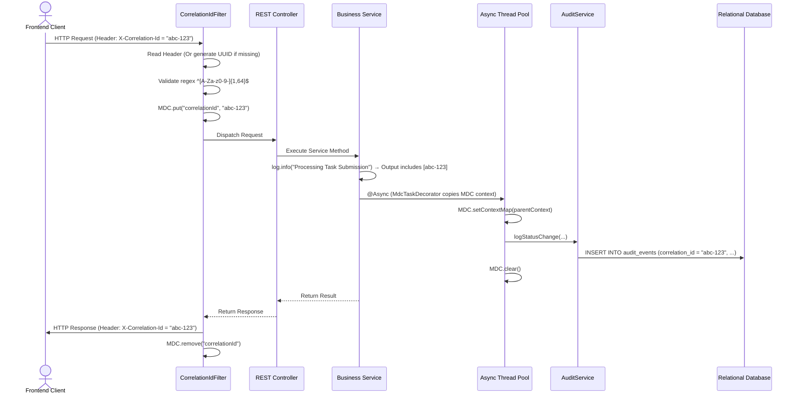

# Operations, Runbooks & Known Issues

Back to **[Master Index](README.md)**

---

## 1. Application Configuration Blueprint (`src/main/resources/application.yml`)

```yaml
server:
  port: 8080
  servlet:
    context-path: /

spring:
  datasource:
    url: ${DB_URL:jdbc:postgresql://localhost:5432/taskflow}
    username: ${DB_USERNAME:postgres}
    password: ${DB_PASSWORD:<REPLACE_WITH_SECURE_DB_PASSWORD>}
    hikari:
      maximum-pool-size: 20
      minimum-idle: 5
  jpa:
    hibernate:
      ddl-auto: validate
    show-sql: false
    properties:
      hibernate.format_sql: true
  flyway:
    enabled: true
    locations: classpath:db/migration

app:
  jwt:
    secret: ${JWT_SECRET:<REPLACE_WITH_SECURE_256BIT_SECRET>}
    refreshSecret: ${JWT_REFRESH_SECRET:<REPLACE_WITH_SEPARATE_SECRET>}
    expiration-ms: 900000           # 15 minutes
    refresh-expiration-ms: 604800000 # 7 days
```

### Required Environment Variables

| Variable | Purpose | Example |
| :--- | :--- | :--- |
| `DB_URL` | JDBC connection string | `jdbc:postgresql://prod-db:5432/taskflow` |
| `DB_USERNAME` | Database username | `taskflow_app` |
| `DB_PASSWORD` | Database password | (secret) |
| `JWT_SECRET` | Access token signing key (min 32 chars) | (256-bit base64) |
| `JWT_REFRESH_SECRET` | Refresh token signing key (separate from JWT_SECRET) | (256-bit base64) |
| `SPRING_MAIL_USERNAME` | Gmail SMTP username | `noreply@company.com` |
| `SPRING_MAIL_PASSWORD` | Gmail app password | (secret) |

---

## 2. Diagram 10: Trace ID MDC Logging Lifecycle



### MDC Propagation Across Async Boundaries

`AsyncConfig.MdcTaskDecorator` ensures that correlation IDs survive thread pool boundaries:

```java
static class MdcTaskDecorator implements TaskDecorator {
    @Override
    public Runnable decorate(Runnable runnable) {
        Map<String, String> contextMap = MDC.getCopyOfContextMap();
        return () -> {
            try {
                if (contextMap != null) MDC.setContextMap(contextMap);
                else MDC.clear();
                runnable.run();
            } finally {
                MDC.clear();
            }
        };
    }
}
```

Applied to all three async executors: `emailExecutor`, `realtimeExecutor`, `auditExecutor`.

---

## 3. Async Thread Pool Configuration

| Executor Bean | Core | Max | Queue | Thread Prefix | Rejection Policy | Purpose |
| :--- | :--- | :--- | :--- | :--- | :--- | :--- |
| `emailExecutor` | 2 | 5 | 1000 | `email-` | `CallerRunsPolicy` | Email sending |
| `realtimeExecutor` | 2 | 4 | 500 | `realtime-` | `CallerRunsPolicy` + warning log | WebSocket notifications, real-time broadcasts |
| `auditExecutor` | 2 | 4 | 1000 | `audit-` | `CallerRunsPolicy` + warning log | Audit event persistence |

All executors:
- `waitForTasksToCompleteOnShutdown = true` (graceful shutdown)
- `awaitTerminationSeconds = 30`
- `MdcTaskDecorator` enabled (correlation ID propagation)
- Backpressure: when queue is full, task runs on caller thread (`CallerRunsPolicy`)

---

## 4. Operational Runbooks

### Runbook 1: Rotating JWT Secret Key
1. Generate a new 256-bit cryptographically random base64 secret key.
2. Update the environment variable `JWT_SECRET` in the target deployment environment (Kubernetes Secret / Environment file).
3. Perform a zero-downtime rolling restart of the application instances.
4. Active short-lived JWT tokens will expire within 15 minutes. Users with active refresh tokens will seamlessly refresh and receive tokens signed with the new key.

### Runbook 2: Database Schema Migration & DDL Management
1. Ensure Spring JPA DDL auto is set to `validate` in production (`spring.jpa.hibernate.ddl-auto: validate`).
2. Flyway will automatically apply pending migrations from `db/migration/` on application startup.
3. **46 migrations** (V1 – V46) are currently defined. Key migrations:
   - V1: Core schema (users, organizations, roles, tasks, projects)
   - V15-V20: Crew system (channels, messages, whiteboards)
   - V30-V35: Security audit tables, notification system
   - V40-V46: Evidence soft-delete, task status history, team messages
4. Validate column constraints, index additions, and foreign key definitions against entity annotations.

### Runbook 3: Disaster Recovery & Backup Restoration
1. **Database**: Schedule automated daily full snapshots and continuous WAL (Write-Ahead Logging) point-in-time recovery.
2. **Restoration Verification**: Test database restoration onto a staging instance quarterly.

### Runbook 4: Investigating Audit Trail
1. Query `audit_events` table filtered by `correlation_id` to trace a complete request lifecycle.
2. Join `task_activity_logs` and `project_activity_logs` for domain-specific audit trails.
3. Check `security_audit_events` for authentication/authorization events (login, logout, password change, failed attempts).

---

## 5. Known Issues, Limitations & Workarounds

| # | Category | Known Limitation / Issue | Impact / Workaround | Recommended Resolution | Status |
| :--- | :--- | :--- | :--- | :--- | :--- |
| KI-1 | **Rate Limiting** | Bucket4j buckets reside in local memory (Caffeine cache) | Single-node only; multi-node clusters will not share bucket counts | Migrate Bucket4j storage backend to Redis | 🔴 Open |
| KI-2 | **Token Denylist** | JWT denylist is Caffeine in-memory | Revoked tokens accepted on other instances | Migrate to Redis-backed denylist | 🔴 Open |
| KI-3 | **Email Dispatch** | Async via `emailExecutor` (max 5 threads, queue 1000) | Under extreme load, CallerRunsPolicy blocks request thread | Add message broker (Kafka/RabbitMQ) for reliable delivery | 🟡 Mitigated |
| KI-4 | **STOMP Scale** | WebSocket broadcast via in-memory `SimpleBrokerMessageHandler` | WebSocket connections tied to single node | Add Redis pub/sub broker relay for multi-node WS | 🔴 Open |
| KI-5 | **CORS** | Allowed origins previously hardcoded | Externalized to `app.security.cors.allowed-origins` (`CORS_ALLOWED_ORIGINS` env var) | Resolved | 🟢 Resolved |
| KI-6 | **IP Spoofing** | Unvalidated `X-Forwarded-For` header trust | Refactored to shared `ClientIpResolver` enforcing `app.security.trusted-proxies` | Resolved | 🟢 Resolved |

---

## 6. System Capacity & Operational Limits

| Resource | Limit | Configurable |
| :--- | :--- | :--- |
| **Hikari DB Connection Pool** | 20 active / 5 idle | `spring.datasource.hikari.maximum-pool-size` |
| **Email Thread Pool** | 5 max threads, 1000 queue | `AsyncConfig.emailExecutor()` |
| **Realtime Thread Pool** | 4 max threads, 500 queue | `AsyncConfig.realtimeExecutor()` |
| **Audit Thread Pool** | 4 max threads, 1000 queue | `AsyncConfig.auditExecutor()` |
| **WebSocket STOMP Buffer** | 64KB per message | `WebSocketConfig` transport limits |
| **WebSocket Heartbeat** | 10s send / 10s receive | `WebSocketConfig` broker heartbeat |
| **Notification Page Size** | Max 100 per request | `NotificationController` caps pageable |
| **Comment Page Size** | Max 100 per request | `TaskCommentController` caps pageable |
| **Auth Rate Limit** | 10 req/min (general), 5 req/hr (forgot-password) | `RateLimitFilter` |
| **Login Rate Limit** | 10/15min per IP+user, 50/15min per IP | `AuthController` |
| **Access Token TTL** | 15 minutes | `app.jwt.expiration-ms` |
| **Refresh Token TTL** | 7 days | `app.jwt.refresh-expiration-ms` |
| **Password Reset Token TTL** | 1 hour | `PasswordResetToken.expiryDate` |
| **Correlation ID Max Length** | 64 chars | `CorrelationIdFilter` regex |

---

## 7. Prometheus Metrics & Observability (`util/TaskMetrics.java`)

Custom domain metrics exposed via Spring Boot Actuator (`/actuator/prometheus`):

| Metric Name | Type | Labels | Description / Usage |
| :--- | :--- | :--- | :--- |
| `taskflow_tasks_total` | Counter | `status`, `priority` | Total task creation events tracked across status/priority |
| `taskflow_task_duration_seconds` | Timer | `priority` | Duration measurement for task completion lifecycle |
| `taskflow_auth_attempts_total` | Counter | `result` (`success` / `failure`) | Authentication attempt success/failure monitoring |
| `taskflow_active_sessions` | Gauge | — | Real-time gauge for active user session count |

