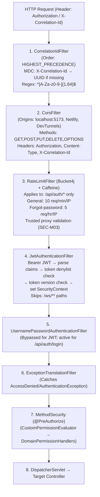

# Security Architecture & Authorization Matrix

Back to **[Master Index](README.md)**

---

## 1. Spring Security 6 Filter Chain Sequence

---

## 2. JWT Token Architecture

### Dual-Key Signing (HS256)

| Token Type | Signing Key | Expiration | Claims |
| :--- | :--- | :--- | :--- |
| **Access Token** | `jwt.secret` (env: `JWT_SECRET`, min 32 chars) | 15 min (900,000ms) | `sub` (username), `roles` (dot-separated), `tv` (token version), `tokenId` (UUID) |
| **Refresh Token** | `jwt.refreshSecret` (env: `JWT_REFRESH_SECRET`) | 7 days (604,800,000ms) | `sub` (username), `tokenId` (UUID) |
| **Email Verification** | `jwt.secret` | 24 hours | `sub` (email), `uid` (user ID), `type` (EMAIL_VERIFICATION), `iss` (Aura), `aud` (email-verification) |

### Token Lifecycle

1. **Issuance**: Login generates both tokens with a shared `tokenId` UUID.
2. **Validation**: `JwtAuthenticationFilter` validates signature → checks denylist → loads UserDetails → compares `tv` claim with `User.tokenVersion`.
3. **Refresh**: `POST /api/session/refresh` — old refresh token invalidated, new token pair issued. Device change detected via User-Agent comparison.
4. **Revocation (single)**: `POST /api/session/logout` — access token added to Caffeine denylist (TTL = remaining lifetime), refresh token deleted.
5. **Revocation (all)**: `POST /api/session/logout-all` — `User.tokenVersion` incremented (invalidates all outstanding JWTs), all refresh tokens deleted.
6. **Replay Detection**: If a previously-replaced refresh token is presented, `TokenRefreshException(REUSE_DETECTED)` → HTTP 401.

---

## 3. SpEL Permission Evaluators & Handlers

Method security annotations (`@PreAuthorize("hasPermission(#taskId, 'Task', 'EDIT')")`) delegate through:

| Component | File | Responsibility |
| :--- | :--- | :--- |
| `CustomPermissionEvaluator` | `security/CustomPermissionEvaluator.java` | Main `PermissionEvaluator` — resolves `User` (request-scoped cache), routes to domain handlers |
| `TaskPermissionHandler` | `security/TaskPermissionHandler.java` | Evaluates task permissions based on mode, ownership, team membership, and role priority |
| `ProjectPermissionHandler` | `security/ProjectPermissionHandler.java` | Validates project creator vs collaborator rights, enforces enterprise project isolation |
| `OrganizationPermissionHandler` | `security/OrganizationPermissionHandler.java` | Evaluates corporate RBAC roles (`ROLE_MANAGE`, `ORG_MEMBER_REMOVE`, `LEAVE_REQUEST_MANAGE`) |
| `RoleStrategyFactory` | `security/RoleStrategyFactory.java` | Resolves `User` → `RoleStrategy` (SuperAdmin vs Employee) |
| `SuperAdminStrategy` | `security/SuperAdminStrategy.java` | **Privacy boundary**: can ONLY manage personal tasks. Cannot view/edit/delete any org task data |
| `EmployeeStrategy` | `security/EmployeeStrategy.java` | Resolves access via org membership role + permissions + team membership + role priority math |

---

## 4. Fine-Grained Role-Permission Matrix

| Permission String | Super Admin | Org Admin | Manager | Member | Crew Owner | Crew Member | Personal Owner |
| :--- | :--- | :--- | :--- | :--- | :--- | :--- | :--- |
| `TASK_VIEW` | Personal only | **Yes** | **Yes** | **Yes** | **Yes** | **Yes** | **Yes** |
| `TASK_EDIT` | Personal only | **Yes** | Assignor/Assignee | Assignee | **Yes** | **Yes** | **Yes** |
| `TASK_DELETE` | Personal only | **Yes** | Creator | No | Creator | No | **Yes** |
| `TASK_ASSIGN` | No | **Yes** | **Yes** (Priority ≥) | Perm Check | No | No | N/A |
| `TASK_REVIEW` | No | **Yes** (Priority >) | Reviewer (Priority >) | No (No self-review) | No | No | No |
| `TASK_ARCHIVE` | Personal only | **Yes** | Creator/Assignee | No | Creator | No | **Yes** |
| `TASK_REASSIGN` | No | **Yes** | Creator | No | Creator | No | Creator |
| `TASK_DEPENDENCY_EDIT` | Personal only | **Yes** | Creator (assignee blocked) | No | Creator | No | Creator |
| `TASK_OVERRIDE` | No | Perm Check | Perm Check | No | No | No | No |
| `ROLE_MANAGE` | No | **Yes** | Perm Check | No | No | No | No |
| `ORG_MEMBER_INVITE` | No | **Yes** | Perm Check | No | No | No | No |
| `ORG_MEMBER_REMOVE` | No | **Yes** | Perm Check | No | No | No | No |
| `LEAVE_REQUEST_MANAGE` | No | **Yes** | **Yes** | No | No | No | No |
| `ANNOUNCEMENT_MANAGE` | No | **Yes** | Perm Check | No | No | No | No |
| `GOAL_MANAGE` | No | **Yes** | Perm Check | No | No | No | No |
| `PROJECT_CREATE` | **Yes** | **Yes** | Perm Check | No | **Yes** | No | **Yes** |
| `PROJECT_MANAGE` | No | **Yes** | Perm Check | No | No | No | No |

**Key constraints:**
- **Reviewer Priority Rule**: Reviewer must have strictly lower `role.priority` value (= higher authority) than the assignee. Same priority is NOT sufficient.
- **Self-Review Prohibition**: Assignee ID ≠ Reviewer ID, enforced in `EmployeeStrategy.canReview()`.
- **Observer Veto**: `TeamObserver` members are vetoed from all write operations via `isObserverVeto()` in `EmployeeStrategy`.
- **Assignee Dependency Veto**: Assignees are explicitly blocked from editing task dependencies — only the creator (assignor) or users with `TASK_DEPENDENCY_EDIT` permission can.

---

## 5. Rate Limiting Architecture

### Global Auth Rate Limit (`RateLimitFilter`)

Applied to all `/api/auth/*` paths via servlet filter:

| Path Pattern | Limit | Window | Per |
| :--- | :--- | :--- | :--- |
| `/api/auth/forgot-password` | 5 requests | 1 hour | IP |
| `/api/auth/*` (all others) | 10 requests | 1 minute | IP |

**Trusted Proxy Validation (SEC-M03)**: `X-Forwarded-For` header is only honored if `request.getRemoteAddr()` is in the `app.security.trusted-proxies` whitelist.

### Per-Endpoint Rate Limits (Controller-level)

| Endpoint | Limit | Window | Per |
| :--- | :--- | :--- | :--- |
| `POST /api/auth/login` | 10/15min + 50/15min | 15 min | IP+username, IP |
| `POST /api/auth/register` | 5/60min | 1 hour | IP |
| `POST /api/session/refresh` | 30/15min | 15 min | IP |
| `GET /api/session/verify-email` | 10/15min | 15 min | IP |
| `POST /api/session/logout` | 20/15min | 15 min | IP |
| `POST /api/session/resend-verification` | 5/60min | 1 hour | IP+email |

All rate limit capacities are configurable via `@Value` annotations (e.g., `${ratelimit.login.capacity:10}`).

---

## 6. In-Depth Security & Vulnerability Audit

### Verified Mitigations

| # | Threat | Mitigation | Status |
| :--- | :--- | :--- | :--- |
| SEC-1 | **IDOR (Horizontal Privilege Escalation)** | `CustomPermissionEvaluator` checks ownership/membership on every entity access | ✅ Verified |
| SEC-2 | **Vertical Privilege Escalation** | `TaskHierarchyValidator` + role priority comparison during assignment | ✅ Verified |
| SEC-3 | **Session Fixation** | Stateless JWT — no server-side sessions | ✅ Verified |
| SEC-4 | **Brute-Force Login** | Two-layer rate limiting (IP + IP+username) | ✅ Verified |
| SEC-5 | **Token Theft (Refresh)** | Single-use rotation with replay detection (`REUSE_DETECTED`) | ✅ Verified |
| SEC-6 | **Mass Invalidation** | `User.tokenVersion` increment invalidates all JWTs | ✅ Verified |
| SEC-7 | **WebSocket Auth** | `StompAuthChannelInterceptor` validates JWT on CONNECT | ✅ Verified |
| SEC-8 | **CSV Injection** | `DashboardController.escapeCsv()` prepends `'` to cells starting with `=+\-@` | ✅ Verified |
| SEC-9 | **Correlation ID Injection** | `CorrelationIdFilter` validates format via regex `^[A-Za-z0-9-]{1,64}$` | ✅ Verified |
| SEC-10 | **HTTP Headers** | HSTS (31536000s), X-Frame-Options DENY, X-XSS-Protection 1;mode=block | ✅ Verified |

### Known Gaps (Needs Verification / Resolution)

| # | Issue | Risk | Recommended Fix |
| :--- | :--- | :--- | :--- |
| SEC-G1 | `AuthController.extractClientIp()` trusts `X-Forwarded-For` unconditionally (unlike fixed `RateLimitFilter`) | IP spoofing for rate limit bypass | Apply same trusted-proxy validation as `RateLimitFilter` |
| SEC-G2 | `SessionController.extractClientIp()` has same issue as SEC-G1 | Same | Same fix |
| SEC-G3 | Token denylist is Caffeine in-memory only | Revoked tokens accepted on other instances in multi-node deployment | Migrate to Redis-backed denylist |
| SEC-G4 | CORS origins are hardcoded in `SecurityConfig` and `WebSocketConfig` | Requires code change to update allowed origins | Externalize to `application.yml` |
