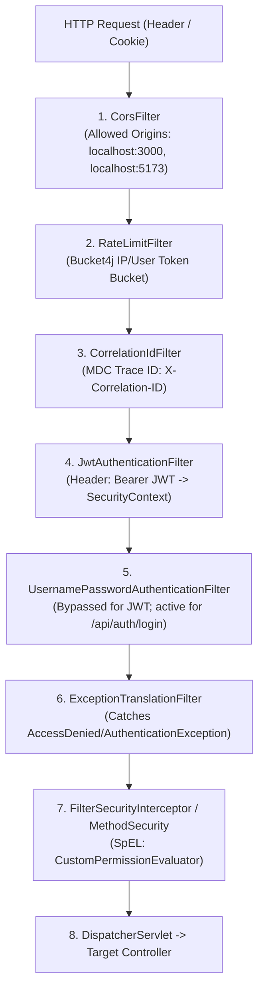

# Security Architecture & Authorization Matrix

Back to **[Master Index](README.md)**

---

## 1. Spring Security 6 Filter Chain Sequence

---

## 2. SpEL Permission Evaluators & Handlers

Method security annotations (`@PreAuthorize("hasPermission(#taskId, 'Task', 'EDIT')")`) delegate through:
- `src/main/java/com/example/taskflow/security/CustomPermissionEvaluator.java`: Main evaluator interface implementation.
- `src/main/java/com/example/taskflow/security/TaskPermissionHandler.java`: Evaluates task permissions based on mode, ownership, and role priority.
- `src/main/java/com/example/taskflow/security/ProjectPermissionHandler.java`: Validates project creator vs collaborator rights. Enforces enterprise project isolation.
- `src/main/java/com/example/taskflow/security/OrganizationPermissionHandler.java`: Evaluates corporate RBAC roles (`ROLE_MANAGE`, `ORG_MEMBER_REMOVE`).

---

## 3. Fine-Grained Role-Permission Matrix

| Permission String | Super Admin | Org Admin | Manager | Member | Crew Owner | Crew Member | Personal Owner |
| :--- | :--- | :--- | :--- | :--- | :--- | :--- | :--- |
| `READ_TASK` | **Yes** | **Yes** | **Yes** | **Yes** | **Yes** | **Yes** | **Yes** |
| `EDIT_TASK` | **Yes** | **Yes** | Assignor | Assignee | **Yes** | **Yes** | **Yes** |
| `DELETE_TASK` | **Yes** | **Yes** | Assignor | No | **Yes** | No | **Yes** |
| `ASSIGN_TASK` | **Yes** | **Yes** | **Yes** (Priority Check)| Perm Check | No | No | No |
| `APPROVE_TASK` | **Yes** | **Yes** | Reviewer | No (No self-approval)| No | No | No |
| `UPLOAD_EVIDENCE` | **Yes** | **Yes** | **Yes** | Assignee | No | No | No |
| `ARCHIVE_TASK` | **Yes** | **Yes** | Assignor | No | **Yes** | No | **Yes** |
| `MANAGE_ROLE` | **Yes** | **Yes** | Perm Check | No | No | No | No |
| `APPROVE_LEAVE` | **Yes** | **Yes** | **Yes** (Manager) | No | No | No | No |

---

## 4. In-Depth Security & Vulnerability Audit

1. **Horizontal Privilege Escalation (IDOR)**: Mitigated by `CustomPermissionEvaluator` checking ownership/membership on entity fetch (`TaskPermissionHandler.canViewTask`, `canEditTask`).
2. **Vertical Privilege Escalation**: Guarded by `TaskHierarchyValidator` during task assignment—users cannot assign tasks to users with higher role priority than themselves.
3. **Session Fixation & Rate Limiting**: `RateLimitFilter` prevents endpoint brute-force. Spring Security generates stateless JWTs on authentication.
4. **WebSocket Authorization**: Handshake interceptor verifies tokens. Channel subscription interceptor verifies active crew membership.
