# Complete System Workflows & Sequence Diagrams

Back to **[Master Index](README.md)**

This document details **every business workflow** implemented across the 32 controllers in the backend, grouped by domain module.

---

## 1. Authentication & Identity Workflows

### Workflow 1.1: User Registration
- **APIs**: `POST /api/auth/register` ([AuthController.java](file:///c:/Users/SEC/OneDrive/Desktop/Project/Ryokai/Ryokai_backend/taskflow/src/main/java/com/example/taskflow/controller/AuthController.java))
- **Service**: `AuthServiceImpl.register`
- **Execution Flow**:
  1. Client sends `RegisterRequestDTO` containing `username`, `email`, `password`.
  2. Verifies username and email uniqueness in `UserRepository`.
  3. Hashes password using `BCryptPasswordEncoder`.
  4. Saves new `User` entity to database (`superAdmin = false`).
  5. Sends email verification token via `EmailService`.

### Workflow 1.2: User Login & JWT Issuance
- **APIs**: `POST /api/auth/login` ([AuthController.java](file:///c:/Users/SEC/OneDrive/Desktop/Project/Ryokai/Ryokai_backend/taskflow/src/main/java/com/example/taskflow/controller/AuthController.java))
- **Diagram 1**: User Registration & Authentication Flow
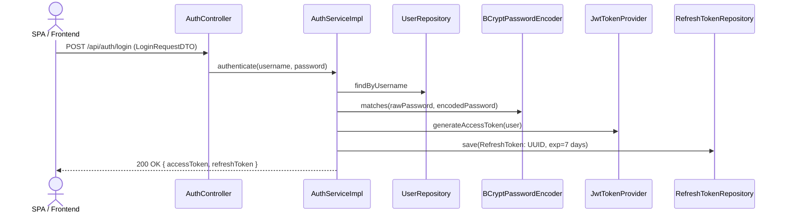

### Workflow 1.3: JWT Refresh Token Rotation
- **APIs**: `POST /api/session/refresh` ([SessionController.java](file:///c:/Users/SEC/OneDrive/Desktop/Project/Ryokai/Ryokai_backend/taskflow/src/main/java/com/example/taskflow/controller/SessionController.java))
- **Diagram 2**: JWT Refresh Token Rotation
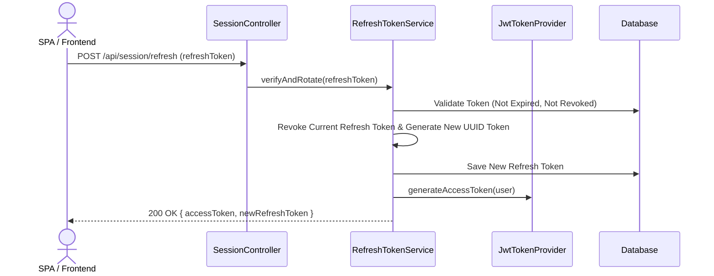

### Workflow 1.4: Password Reset Pipeline
- **APIs**: `POST /api/auth/forgot-password` & `POST /api/auth/reset-password` ([PasswordResetController.java](file:///c:/Users/SEC/OneDrive/Desktop/Project/Ryokai/Ryokai_backend/taskflow/src/main/java/com/example/taskflow/controller/PasswordResetController.java))
- **Execution**: User inputs email -> System generates `PasswordResetToken` (1-hour expiration) and emails reset link -> User presents token + new password -> Password updated with BCrypt hash -> Reset token revoked.

### Workflow 1.5: Session Logout & Invalidation
- **APIs**: `POST /api/session/logout` & `POST /api/session/logout-all` ([SessionController.java](file:///c:/Users/SEC/OneDrive/Desktop/Project/Ryokai/Ryokai_backend/taskflow/src/main/java/com/example/taskflow/controller/SessionController.java))
- **Execution**: `logout` revokes current refresh token and adds current access JWT to `TokenDenylistService`. `logout-all` revokes all refresh tokens issued to the user across all devices.

---

## 2. Organization & Enterprise Vault Workflows

### Workflow 2.1: Provisioning Corporate Organization & Custom RBAC
- **APIs**: `POST /api/organizations` & `POST /api/organizations/{id}/roles` ([OrganizationController.java](file:///c:/Users/SEC/OneDrive/Desktop/Project/Ryokai/Ryokai_backend/taskflow/src/main/java/com/example/taskflow/controller/OrganizationController.java), [OrganizationRoleController.java](file:///c:/Users/SEC/OneDrive/Desktop/Project/Ryokai/Ryokai_backend/taskflow/src/main/java/com/example/taskflow/controller/OrganizationRoleController.java))
- **Execution**: Admin creates Organization -> Owner membership assigned -> Admin creates custom roles specifying integer `priority` (e.g. Director=90, Manager=50, Lead=30, Member=10) -> Permissions assigned via `PUT /api/organizations/{id}/roles/{roleId}/permissions`.

### Workflow 2.2: Department Team Structuring & Observer Oversight
- **APIs**: `POST /api/organizations/{id}/teams` & `POST /api/organizations/teams/{teamId}/observers` ([OrganizationTeamController.java](file:///c:/Users/SEC/OneDrive/Desktop/Project/Ryokai/Ryokai_backend/taskflow/src/main/java/com/example/taskflow/controller/OrganizationTeamController.java))
- **Execution**: Admin creates team under Organization -> Members added via `POST /teams/{teamId}/members` -> Read-only `TeamObserver`s assigned via `POST /teams/{teamId}/observers` for auditor/management visibility without mutation permissions.

### Workflow 2.3: In-App & Link Invitations
- **APIs**: `POST /api/organizations/{orgId}/invites` & `POST /api/organizations/{orgId}/invites/link` ([OrganizationInviteController.java](file:///c:/Users/SEC/OneDrive/Desktop/Project/Ryokai/Ryokai_backend/taskflow/src/main/java/com/example/taskflow/controller/OrganizationInviteController.java))
- **Execution**: Admin generates in-app invite for username or shareable link token -> Invitee accepts via `POST /api/invites/{inviteId}/accept` or `POST /api/invites/token/{token}/accept` -> Invitee assigned specified role in `organization_memberships`.

### Workflow 2.4: HR Leave Request & Active Task Reassignment
- **APIs**: `POST /api/organizations/{id}/leave` & `POST /api/organizations/{id}/leave/{requestId}/approve` ([OrganizationMembershipController.java](file:///c:/Users/SEC/OneDrive/Desktop/Project/Ryokai/Ryokai_backend/taskflow/src/main/java/com/example/taskflow/controller/OrganizationMembershipController.java))
- **Diagram 9**: HR Leave Request & Task Reassignment
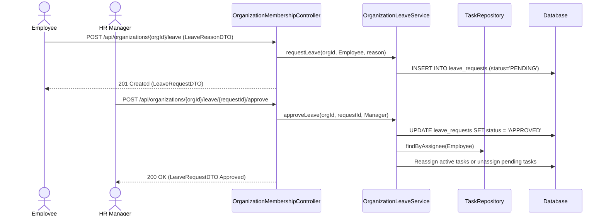

### Workflow 2.5: Admin Force-Leave / Dissolution
- **APIs**: `POST /api/organizations/{id}/admin-leave` ([OrganizationMembershipController.java](file:///c:/Users/SEC/OneDrive/Desktop/Project/Ryokai/Ryokai_backend/taskflow/src/main/java/com/example/taskflow/controller/OrganizationMembershipController.java))
- **Execution**: Owner chooses successor user ID and specifies whether to transfer ownership or dissolve org -> `OrganizationLifecycleService.leaveOrDissolve` validates no active non-terminal tasks remain -> Updates owner or soft-deletes organization.

---

## 3. Crew & Collaboration Workflows

### Workflow 3.1: Crew Discovery, Join & Ownership Transfer
- **APIs**: `POST /api/crews`, `GET /api/crews/discover`, `POST /api/crews/{crewId}/join`, `PUT /api/crews/{crewId}/transfer-ownership/{newOwnerId}` ([CrewController.java](file:///c:/Users/SEC/OneDrive/Desktop/Project/Ryokai/Ryokai_backend/taskflow/src/main/java/com/example/taskflow/controller/CrewController.java))
- **Execution**: Users create crew or discover public crews (`visibility = PUBLIC`) -> Authenticated user joins directly -> Creator can transfer ownership to any crew member.

### Workflow 3.2: Channel Messaging & Chat-to-Task Conversion
- **APIs**: `POST /api/crews/{crewId}/channels/{channelId}/messages` & `POST .../convert-to-task` ([CrewController.java](file:///c:/Users/SEC/OneDrive/Desktop/Project/Ryokai/Ryokai_backend/taskflow/src/main/java/com/example/taskflow/controller/CrewController.java))
- **Diagram 10**: Convert Chat Message to Task Flow
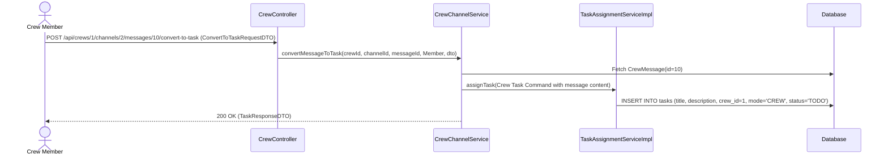

### Workflow 3.3: Interactive STOMP Whiteboard Session
- **APIs**: `POST /api/crews/{crewId}/whiteboards` & `@MessageMapping("/whiteboards/{boardId}/draw")` ([WhiteboardController.java](file:///c:/Users/SEC/OneDrive/Desktop/Project/Ryokai/Ryokai_backend/taskflow/src/main/java/com/example/taskflow/controller/WhiteboardController.java), [WhiteboardSocketController.java](file:///c:/Users/SEC/OneDrive/Desktop/Project/Ryokai/Ryokai_backend/taskflow/src/main/java/com/example/taskflow/controller/WhiteboardSocketController.java))
- **Diagram 11**: Crew Real-Time Whiteboard Drawing Flow
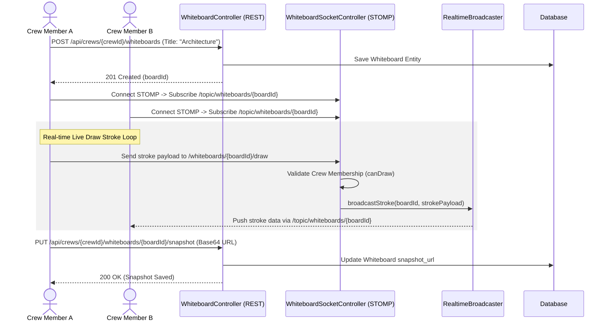

---

## 4. Task System Workflows

### Workflow 4.1: Task Assignment & Hierarchy Validation
- **APIs**: `POST /api/tasks/assign`, `POST /api/tasks/personal`, `POST /api/tasks/crew` ([TaskAssignmentController.java](file:///c:/Users/SEC/OneDrive/Desktop/Project/Ryokai/Ryokai_backend/taskflow/src/main/java/com/example/taskflow/controller/TaskAssignmentController.java))
- **Diagram 3**: Enterprise Task Assignment & Hierarchy Validation
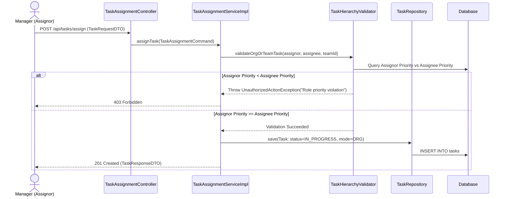

### Workflow 4.2: Bulk Task Assignment
- **APIs**: `POST /api/tasks/bulk-assign` ([TaskAssignmentController.java](file:///c:/Users/SEC/OneDrive/Desktop/Project/Ryokai/Ryokai_backend/taskflow/src/main/java/com/example/taskflow/controller/TaskAssignmentController.java))
- **Execution**: Assignor supplies list of `assigneeUsernames` (`BulkAssignRequestDTO`) -> `TaskBulkAssignmentService` iterates through list, executing individual `TaskHierarchyValidator` checks -> Creates individual tasks -> Returns `BulkAssignResponseDTO` listing successful assignments and skipped users.

### Workflow 4.3: Crew Task Claiming
- **APIs**: `POST /api/tasks/{taskId}/claim` ([TaskStateController.java](file:///c:/Users/SEC/OneDrive/Desktop/Project/Ryokai/Ryokai_backend/taskflow/src/main/java/com/example/taskflow/controller/TaskStateController.java))
- **Diagram 9**: Crew Task Claiming Flow
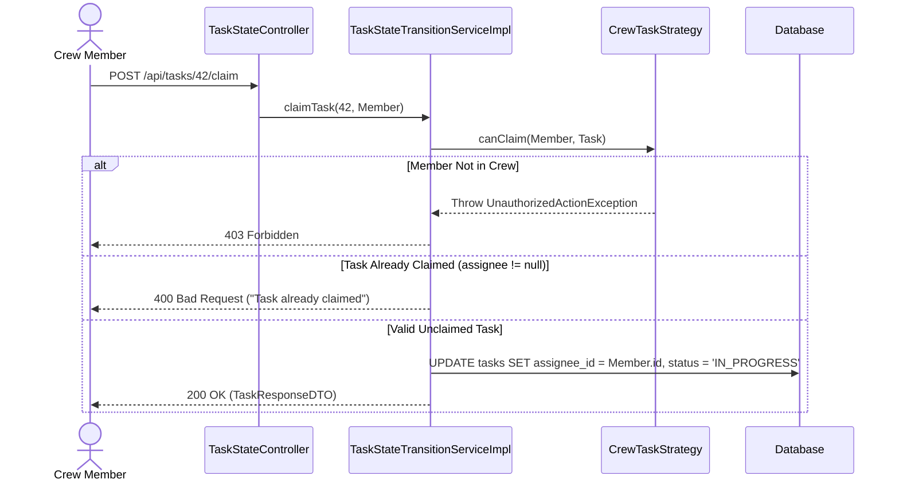

### Workflow 4.4: Task Evidence Upload & Org Submission
- **APIs**: `POST /api/tasks/{taskId}/evidence` & `POST /api/tasks/{taskId}/submit` ([TaskEvidenceController.java](file:///c:/Users/SEC/OneDrive/Desktop/Project/Ryokai/Ryokai_backend/taskflow/src/main/java/com/example/taskflow/controller/TaskEvidenceController.java), [TaskStateController.java](file:///c:/Users/SEC/OneDrive/Desktop/Project/Ryokai/Ryokai_backend/taskflow/src/main/java/com/example/taskflow/controller/TaskStateController.java))
- **Diagram 4**: Task Evidence Upload & Submission
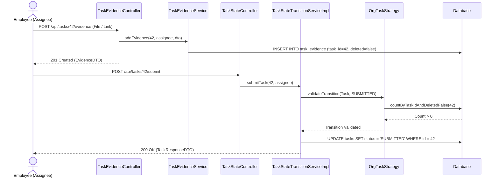

### Workflow 4.5: Manager Task Approval
- **APIs**: `POST /api/tasks/{taskId}/approve` ([TaskStateController.java](file:///c:/Users/SEC/OneDrive/Desktop/Project/Ryokai/Ryokai_backend/taskflow/src/main/java/com/example/taskflow/controller/TaskStateController.java))
- **Diagram 5**: Manager Task Approval Flow
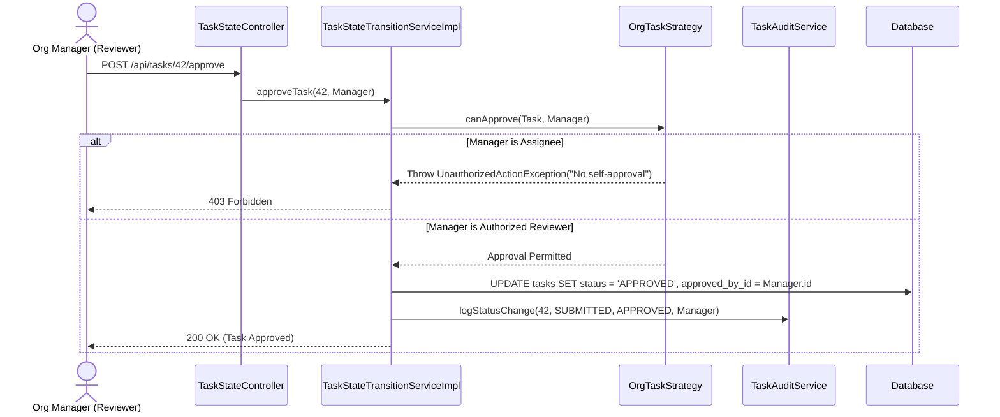

### Workflow 4.6: Manager Task Rejection
- **APIs**: `POST /api/tasks/{taskId}/reject` ([TaskStateController.java](file:///c:/Users/SEC/OneDrive/Desktop/Project/Ryokai/Ryokai_backend/taskflow/src/main/java/com/example/taskflow/controller/TaskStateController.java))
- **Diagram 6**: Manager Task Rejection Flow
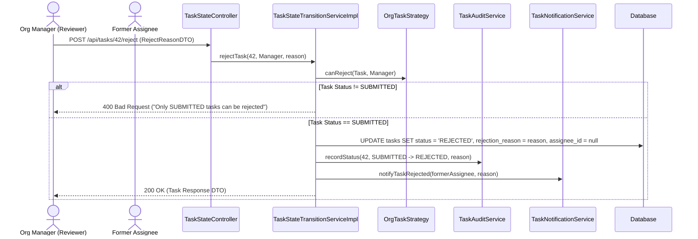

### Workflow 4.7: Assignee Task Recall
- **APIs**: `POST /api/tasks/{taskId}/recall` ([TaskStateController.java](file:///c:/Users/SEC/OneDrive/Desktop/Project/Ryokai/Ryokai_backend/taskflow/src/main/java/com/example/taskflow/controller/TaskStateController.java))
- **Diagram 7**: Assignee Task Recall Sequence
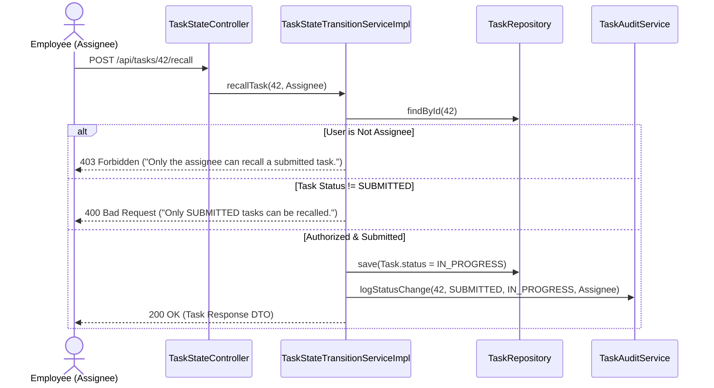

### Workflow 4.8: Task Reassignment
- **APIs**: `PUT /api/tasks/{taskId}/reassign` ([TaskAssignmentController.java](file:///c:/Users/SEC/OneDrive/Desktop/Project/Ryokai/Ryokai_backend/taskflow/src/main/java/com/example/taskflow/controller/TaskAssignmentController.java))
- **Diagram 8**: Task Reassignment Flow
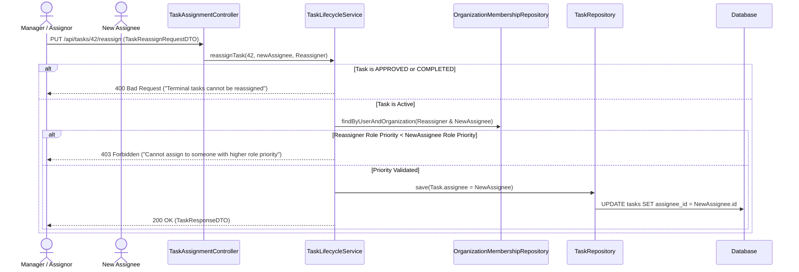

### Workflow 4.9: Task Checklist Sub-task Management
- **APIs**: `POST /api/tasks/{taskId}/checklists` & `POST .../{itemId}/toggle` ([TaskChecklistController.java](file:///c:/Users/SEC/OneDrive/Desktop/Project/Ryokai/Ryokai_backend/taskflow/src/main/java/com/example/taskflow/controller/TaskChecklistController.java))
- **Execution**: Assignee adds checklist items -> Toggles completion status (`completed = !completed`) -> ChecklistService recalculates progress percentage.

### Workflow 4.10: Task Dependency Creation & Resolution
- **APIs**: `POST /api/tasks/{taskId}/dependencies` ([TaskDependencyController.java](file:///c:/Users/SEC/OneDrive/Desktop/Project/Ryokai/Ryokai_backend/taskflow/src/main/java/com/example/taskflow/controller/TaskDependencyController.java))
- **Execution**: User links prerequisite task (`dependsOnTaskId`) -> `TaskDependencyService` validates scope equality -> When prerequisite task moves to `APPROVED`/`COMPLETED`, `TaskStateTransitionServiceImpl` emits `DEPENDENCY_RESOLVED` notification.

---

## 5. Project System Workflows

### Workflow 5.1: Personal Project Creation
- **APIs**: `POST /api/projects` ([ProjectController.java](file:///c:/Users/SEC/OneDrive/Desktop/Project/Ryokai/Ryokai_backend/taskflow/src/main/java/com/example/taskflow/controller/ProjectController.java))
- **Service**: `ProjectService.createProject`
- **Execution Flow**:
  1. User sends `ProjectRequestDTO` with `name`, `description`, `color`, `dueDate`.
  2. Sets `createdBy = currentUser`, `organization = null`, `team = null`.
  3. Saves `Project` entity to database.
  4. Returns `ProjectResponseDTO` with empty tasks list.

### Workflow 5.2: Enterprise Organization Project Creation
- **APIs**: `POST /api/projects` ([ProjectController.java](file:///c:/Users/SEC/OneDrive/Desktop/Project/Ryokai/Ryokai_backend/taskflow/src/main/java/com/example/taskflow/controller/ProjectController.java))
- **Execution Flow**:
  1. Manager sends `ProjectRequestDTO` specifying `organizationId` or `teamId`.
  2. Validates user is an authorized member of the organization.
  3. Sets `project.organization = org` and `project.team = team`.
  4. Sealed corporate project created—access governed by `ProjectPermissionHandler`.

### Workflow 5.3: Project Connection Bridge (Sharing Personal Project with Crew)
- **APIs**: `POST /api/projects/{projectId}/share/crew` ([ProjectController.java](file:///c:/Users/SEC/OneDrive/Desktop/Project/Ryokai/Ryokai_backend/taskflow/src/main/java/com/example/taskflow/controller/ProjectController.java)) & `POST /api/crews/{crewId}/projects/{projectId}` ([CrewController.java](file:///c:/Users/SEC/OneDrive/Desktop/Project/Ryokai/Ryokai_backend/taskflow/src/main/java/com/example/taskflow/controller/CrewController.java))
- **Service**: `ProjectService.shareProjectToCrew` & `CrewProjectService.shareProject`
- **Diagram 12**: Project Connection Bridge (Sharing & Revocation)
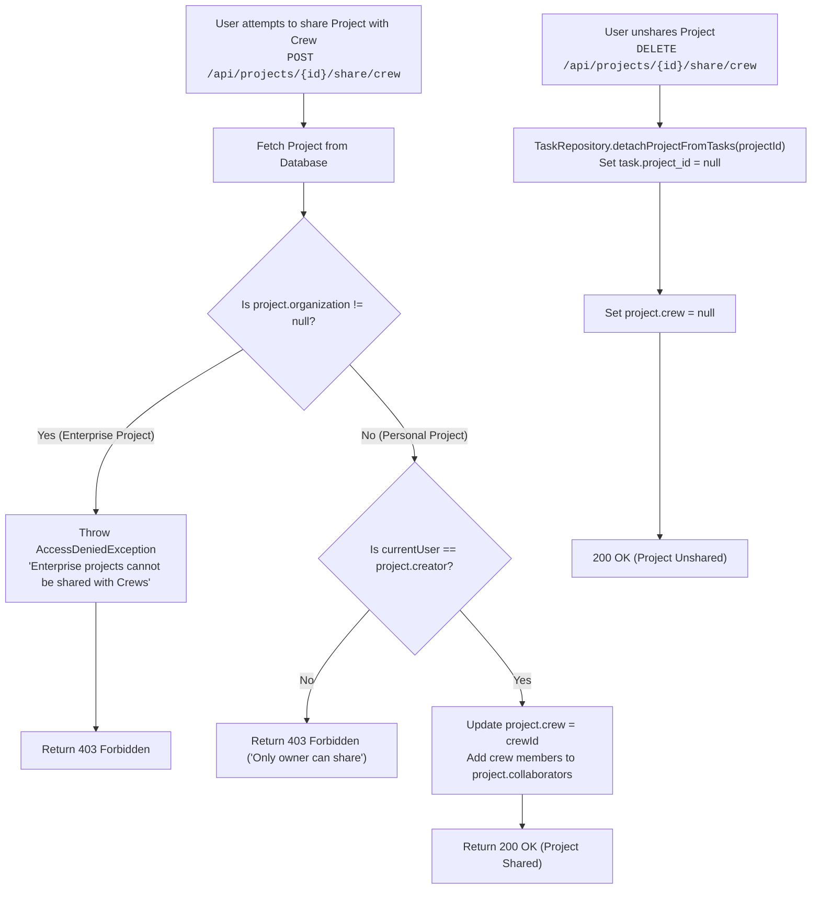

### Workflow 5.4: Unsharing Project from Crew (Revocation)
- **APIs**: `DELETE /api/projects/{projectId}/share/crew` ([ProjectController.java](file:///c:/Users/SEC/OneDrive/Desktop/Project/Ryokai/Ryokai_backend/taskflow/src/main/java/com/example/taskflow/controller/ProjectController.java)) & `DELETE /api/crews/{crewId}/projects/{projectId}` ([CrewController.java](file:///c:/Users/SEC/OneDrive/Desktop/Project/Ryokai/Ryokai_backend/taskflow/src/main/java/com/example/taskflow/controller/CrewController.java))
- **Execution**: Only project creator or crew admin can unshare -> Removes crew from `project.sharedCrews` -> Executes `taskRepository.detachProjectFromTasks(projectId)` to un-link crew tasks from the project -> Returns updated `ProjectResponseDTO`.

### Workflow 5.5: Project Modification & Collaborator Management
- **APIs**: `PUT /api/projects/{projectId}` ([ProjectController.java](file:///c:/Users/SEC/OneDrive/Desktop/Project/Ryokai/Ryokai_backend/taskflow/src/main/java/com/example/taskflow/controller/ProjectController.java))
- **Execution**: `@PreAuthorize("hasPermission(#projectId, 'Project', 'EDIT')")` evaluates ownership -> Updates title, description, color, or adds explicit collaborator user IDs (`project.collaborators`).

### Workflow 5.6: Project Deletion & Soft Task Detachment
- **APIs**: `DELETE /api/projects/{projectId}` ([ProjectController.java](file:///c:/Users/SEC/OneDrive/Desktop/Project/Ryokai/Ryokai_backend/taskflow/src/main/java/com/example/taskflow/controller/ProjectController.java))
- **Execution**: `@PreAuthorize("hasPermission(#projectId, 'Project', 'DELETE')")` -> Detaches `project_id` on associated tasks (`set project_id = null`) -> Removes project entity from database.

---

## 6. Personal Workspace Workflows

### Workflow 6.1: Private Notes, Pomodoro Timers & Calendar Scheduling
- **APIs**: `POST /api/notes`, `POST /api/focus/start`, `POST /api/focus/{id}/stop`, `POST /api/calendar-events` ([NoteController.java](file:///c:/Users/SEC/OneDrive/Desktop/Project/Ryokai/Ryokai_backend/taskflow/src/main/java/com/example/taskflow/controller/NoteController.java), [FocusSessionController.java](file:///c:/Users/SEC/OneDrive/Desktop/Project/Ryokai/Ryokai_backend/taskflow/src/main/java/com/example/taskflow/controller/FocusSessionController.java), [CalendarEventController.java](file:///c:/Users/SEC/OneDrive/Desktop/Project/Ryokai/Ryokai_backend/taskflow/src/main/java/com/example/taskflow/controller/CalendarEventController.java))
- **Execution**: User creates markdown note -> Starts focus session tied to optional task (`FocusSession.startedAt = NOW`) -> Stops session (`FocusSession.durationMinutes` computed) -> Schedules private calendar events.

### Workflow 6.2: Entity Bookmarking & Dashboard Analytics
- **APIs**: `POST /api/saved-items` & `GET /api/dashboard/stats` ([SavedItemController.java](file:///c:/Users/SEC/OneDrive/Desktop/Project/Ryokai/Ryokai_backend/taskflow/src/main/java/com/example/taskflow/controller/SavedItemController.java), [DashboardController.java](file:///c:/Users/SEC/OneDrive/Desktop/Project/Ryokai/Ryokai_backend/taskflow/src/main/java/com/example/taskflow/controller/DashboardController.java))
- **Execution**: User bookmarks task, note, or project -> Saved item displayed in quick access bar -> `DashboardService` aggregates counts evaluating `isTerminal()` status logic (`status == APPROVED` or `status == COMPLETED`).
