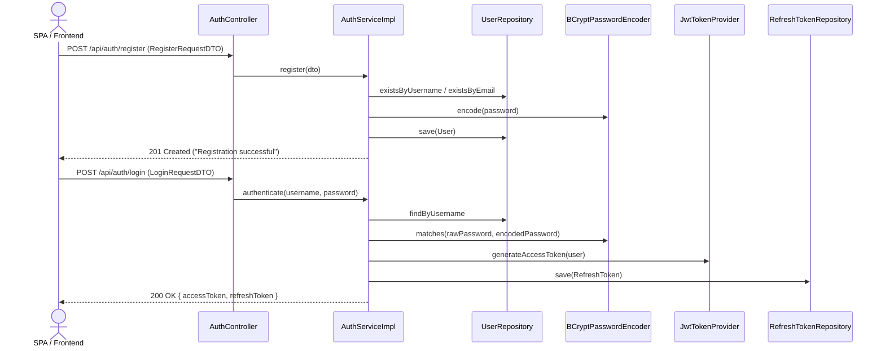
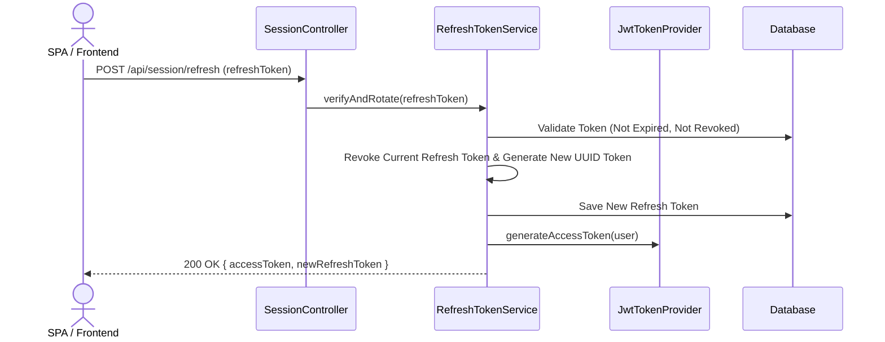
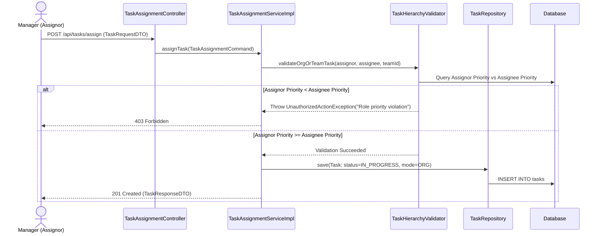
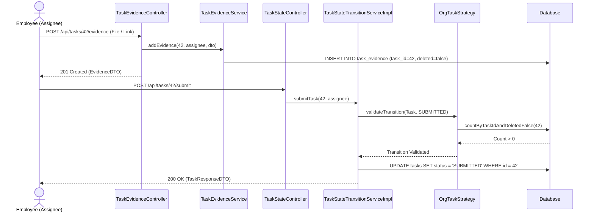
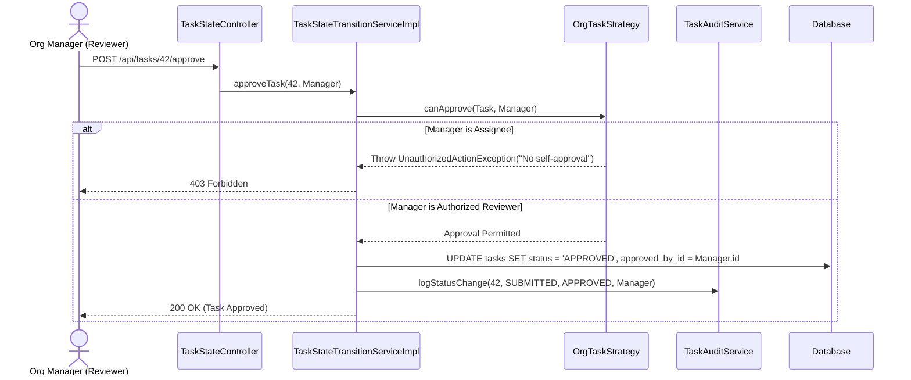
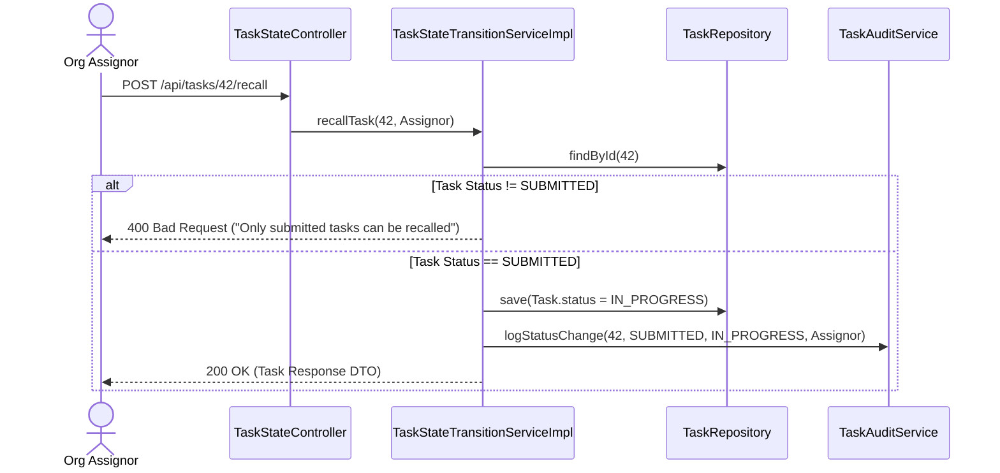
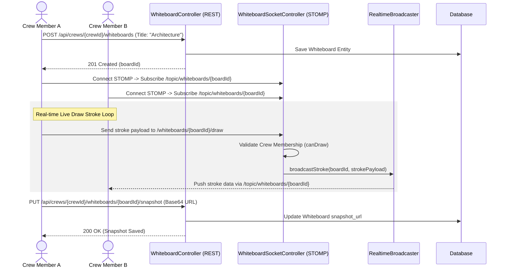
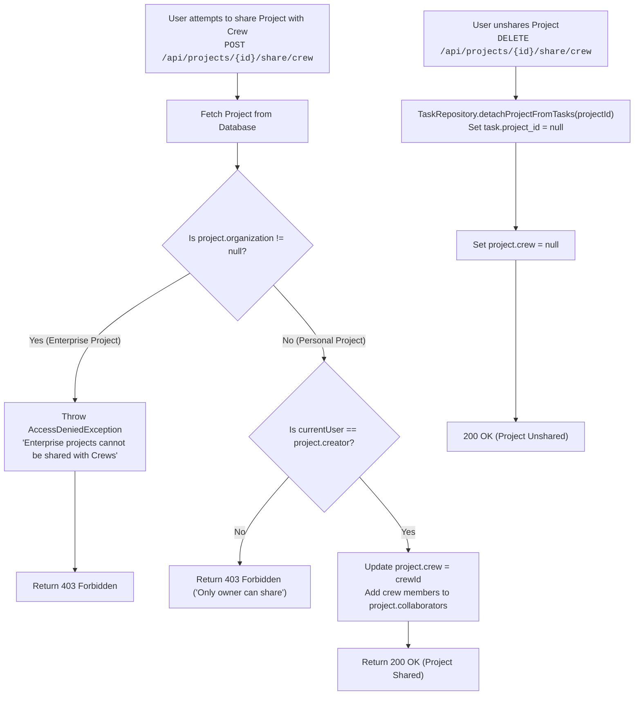
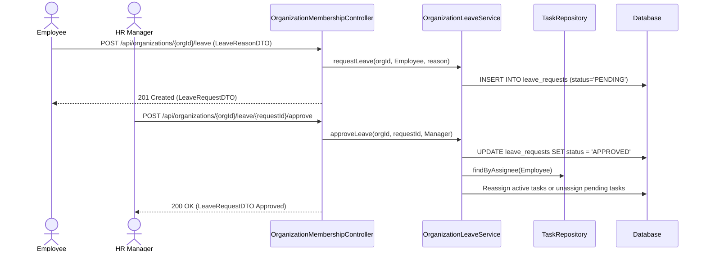

# Workflows & Sequence Diagrams

Back to **[Master Index](README.md)**

---

### Diagram 1: User Registration & Authentication Flow

---

### Diagram 2: JWT Refresh Token Rotation

---

### Diagram 3: Enterprise Task Assignment & Hierarchy Validation

---

### Diagram 4: Task Evidence Upload & Submission

---

### Diagram 5: Manager Approval & Rejection Flow

---

### Diagram 6: Assignor Task Recall Sequence

---

### Diagram 7: Crew Real-Time Whiteboard Drawing Flow

---

### Diagram 8: Project Connection Bridge (Sharing & Revocation)

---

### Diagram 9: HR Leave Request & Task Reassignment

